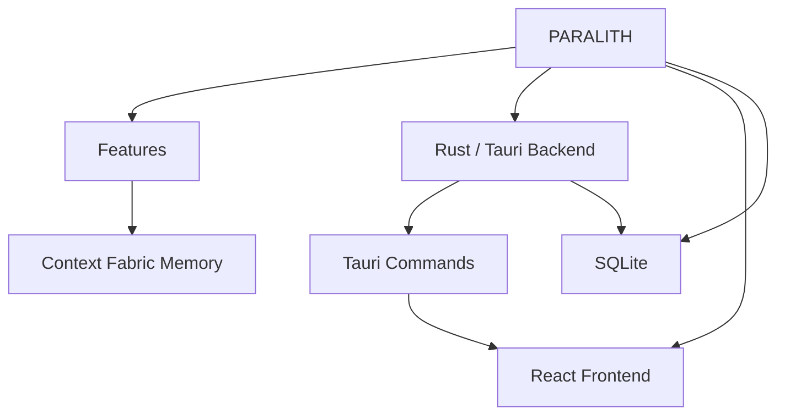

<!-- PARALITH:AUTO:START -->

# Architecture Overview

## Key Modules

- [[corelith_site]] - Package manifest discovered at `corelith-site/package.json`.
- [[corelith_web]] - Package manifest discovered at `corelith-web/package.json`.
- [[paralith-marketing-video]] - Package manifest discovered at `marketing/paralith-video/package.json`.
- [[paralith]] - Package manifest discovered at `Paralith-tauri/package.json`.
- [[forgemind]] - Package manifest discovered at `Paralith-tauri/src-tauri/Cargo.toml`.
- [[dbstudio-fixture-drizzle]] - Package manifest discovered at `Paralith-tauri/src-tauri/tests/fixtures/database_studio/drizzle/package.json`.
- [[@repo-analytics]] - Package manifest discovered at `Paralith-tauri/src-tauri/tests/fixtures/database_studio/monorepo_shared_db/apps/analytic
- [[@repo-api]] - Package manifest discovered at `Paralith-tauri/src-tauri/tests/fixtures/database_studio/monorepo_shared_db/apps/api/pack
- [[@repo-worker]] - Package manifest discovered at `Paralith-tauri/src-tauri/tests/fixtures/database_studio/monorepo_shared_db/apps/worker/p
- [[dbstudio-fixture-monorepo]] - Package manifest discovered at `Paralith-tauri/src-tauri/tests/fixtures/database_studio/monorepo_shared_db/package.json`
- [[@repo-db]] - Package manifest discovered at `Paralith-tauri/src-tauri/tests/fixtures/database_studio/monorepo_shared_db/packages/db/p
- [[dbstudio-fixture-multi-logical-db]] - Package manifest discovered at `Paralith-tauri/src-tauri/tests/fixtures/database_studio/multi_logical_db/package.json`.
- [[dbstudio-fixture-prisma]] - Package manifest discovered at `Paralith-tauri/src-tauri/tests/fixtures/database_studio/prisma/package.json`.
- [[Paralith-tauri - src-tauri - build]] - Rust module `Paralith-tauri/src-tauri/build.rs`
- [[rust - agents - adapter]] - Rust module `Paralith-tauri/src-tauri/src/agents/adapter.rs` Defines: AgentLaunchSpec, ProviderAdapter.
- [[rust - agents - mod]] - Rust module `Paralith-tauri/src-tauri/src/agents/mod.rs`
- [[rust - agents - model_registry]] - Rust module `Paralith-tauri/src-tauri/src/agents/model_registry.rs` Defines: RegisteredModel.
- [[rust - build_info]] - Rust module `Paralith-tauri/src-tauri/src/build_info.rs` Defines: BuildInfo.
- [[rust - commands - agent_commands]] - Rust module `Paralith-tauri/src-tauri/src/commands/agent_commands.rs` exposes Tauri command(s): detect_agents, list_agen
- [[rust - commands - browser_commands]] - Rust module `Paralith-tauri/src-tauri/src/commands/browser_commands.rs` exposes Tauri command(s): open_browser_view, bro
- [[rust - commands - code_commands]] - Rust module `Paralith-tauri/src-tauri/src/commands/code_commands.rs`
- [[rust - commands - database_commands]] - Rust module `Paralith-tauri/src-tauri/src/commands/database_commands.rs` exposes Tauri command(s): database_discover_sou
- [[rust - commands - diagnostics_commands]] - Rust module `Paralith-tauri/src-tauri/src/commands/diagnostics_commands.rs` exposes Tauri command(s): get_diagnostics, r
- [[rust - commands - fabric_ipc]] - Rust module `Paralith-tauri/src-tauri/src/commands/fabric_ipc.rs` exposes Tauri command(s): fabric_memory, fabric_intell
- [[rust - commands - fabric_scope]] - Rust module `Paralith-tauri/src-tauri/src/commands/fabric_scope.rs`
- [[rust - commands - filesystem_commands]] - Rust module `Paralith-tauri/src-tauri/src/commands/filesystem_commands.rs` exposes Tauri command(s): list_project_direct
- [[rust - commands - git_commands]] - Rust module `Paralith-tauri/src-tauri/src/commands/git_commands.rs` exposes Tauri command(s): get_pane_git_review, stage
- [[rust - commands - intelligence_commands]] - Rust module `Paralith-tauri/src-tauri/src/commands/intelligence_commands.rs`
- [[rust - commands - memory_commands]] - Rust module `Paralith-tauri/src-tauri/src/commands/memory_commands.rs`
- [[rust - commands - mod]] - Rust module `Paralith-tauri/src-tauri/src/commands/mod.rs`
- [[rust - commands - orchestration_commands]] - Rust module `Paralith-tauri/src-tauri/src/commands/orchestration_commands.rs` exposes Tauri command(s): orchestrator_cre
- [[rust - commands - project_commands]] - Rust module `Paralith-tauri/src-tauri/src/commands/project_commands.rs` exposes Tauri command(s): open_project, get_proj
- [[rust - commands - repository_commands]] - Rust module `Paralith-tauri/src-tauri/src/commands/repository_commands.rs` exposes Tauri command(s): inspect_repository,
- [[rust - commands - semantic_commands]] - Rust module `Paralith-tauri/src-tauri/src/commands/semantic_commands.rs` Defines: SaveEmbeddingSettingsRequest.
- [[rust - commands - settings_commands]] - Rust module `Paralith-tauri/src-tauri/src/commands/settings_commands.rs` exposes Tauri command(s): get_settings, save_se
- [[rust - commands - swarm_commands]] - Rust module `Paralith-tauri/src-tauri/src/commands/swarm_commands.rs` exposes Tauri command(s): list_swarm_presets, list
- [[rust - commands - terminal_commands]] - Rust module `Paralith-tauri/src-tauri/src/commands/terminal_commands.rs` exposes Tauri command(s): create_terminal_sessi
- [[rust - commands - update_commands]] - Rust module `Paralith-tauri/src-tauri/src/commands/update_commands.rs` exposes Tauri command(s): get_update_status, get_
- [[rust - commands - usage_commands]] - Rust module `Paralith-tauri/src-tauri/src/commands/usage_commands.rs` exposes Tauri command(s): get_ai_usage_history, ge
- [[rust - commands - usage_telemetry_commands]] - Rust module `Paralith-tauri/src-tauri/src/commands/usage_telemetry_commands.rs` exposes Tauri command(s): usage_telemetr
- [[rust - commands - window_commands]] - Rust module `Paralith-tauri/src-tauri/src/commands/window_commands.rs` exposes Tauri command(s): list_open_projects, ope
- [[rust - commands - workspace_commands]] - Rust module `Paralith-tauri/src-tauri/src/commands/workspace_commands.rs` exposes Tauri command(s): get_layout_preset, s
- [[rust - database - backup]] - Rust module `Paralith-tauri/src-tauri/src/database/backup.rs` Defines: BackupFile, BackupManifest, BackupRoots, Database
- [[rust - database - code]] - Rust module `Paralith-tauri/src-tauri/src/database/code.rs`
- [[rust - database - database_studio]] - Rust module `Paralith-tauri/src-tauri/src/database/database_studio.rs` Defines: IssueDetail, RevisionDecision.
- [[rust - database - embeddings]] - Rust module `Paralith-tauri/src-tauri/src/database/embeddings.rs` Defines: EmbeddingUpsert.
- [[rust - database - graph]] - Rust module `Paralith-tauri/src-tauri/src/database/graph.rs` Defines: ContextBody, GraphRow, RawEdge, RelationEdge.
- [[rust - database - intelligence]] - Rust module `Paralith-tauri/src-tauri/src/database/intelligence.rs`
- [[rust - database - knowledge_jobs]] - Rust module `Paralith-tauri/src-tauri/src/database/knowledge_jobs.rs`
- [[rust - database - legacy_migration]] - Rust module `Paralith-tauri/src-tauri/src/database/legacy_migration.rs` Defines: LegacyMigrationRoots, LegacyMigrationSt
- [[rust - database - memory]] - Rust module `Paralith-tauri/src-tauri/src/database/memory.rs` Defines: ParsedQuery.
- [[rust - database - migrations]] - Rust module `Paralith-tauri/src-tauri/src/database/migrations.rs` Defines: Row.
- [[rust - database - mod]] - Rust module `Paralith-tauri/src-tauri/src/database/mod.rs` Defines: DatabaseService, PaneWorktreeRecord.
- [[rust - database - orchestration]] - Rust module `Paralith-tauri/src-tauri/src/database/orchestration.rs`
- [[rust - database - placement]] - Rust module `Paralith-tauri/src-tauri/src/database/placement.rs`
- [[rust - database - repair]] - Rust module `Paralith-tauri/src-tauri/src/database/repair.rs`
- [[rust - database - repository]] - Rust module `Paralith-tauri/src-tauri/src/database/repository.rs` Defines: NewRepositoryOperation.
- [[rust - database - search]] - Rust module `Paralith-tauri/src-tauri/src/database/search.rs` Defines: Fixture, FlatSpec.
- [[rust - database - swarm]] - Rust module `Paralith-tauri/src-tauri/src/database/swarm.rs` Defines: NewSwarmTask, SwarmAgentRunCompletion.
- [[rust - database - usage]] - Rust module `Paralith-tauri/src-tauri/src/database/usage.rs`

## Commands

- [[detect_agents]] - Tauri command `detect_agents` declared in `Paralith-tauri/src-tauri/src/commands/agent_commands.rs`.
- [[list_agent_profiles]] - Tauri command `list_agent_profiles` declared in `Paralith-tauri/src-tauri/src/commands/agent_commands.rs`.
- [[list_agent_sessions]] - Tauri command `list_agent_sessions` declared in `Paralith-tauri/src-tauri/src/commands/agent_commands.rs`.
- [[reconcile_agent_resume_sessions]] - Tauri command `reconcile_agent_resume_sessions` declared in `Paralith-tauri/src-tauri/src/commands/agent_commands.rs`.
- [[list_agent_resume_sessions]] - Tauri command `list_agent_resume_sessions` declared in `Paralith-tauri/src-tauri/src/commands/agent_commands.rs`.
- [[resume_agent_session]] - Tauri command `resume_agent_session` declared in `Paralith-tauri/src-tauri/src/commands/agent_commands.rs`.
- [[dismiss_agent_resume_session]] - Tauri command `dismiss_agent_resume_session` declared in `Paralith-tauri/src-tauri/src/commands/agent_commands.rs`.
- [[dismiss_all_agent_resume_sessions]] - Tauri command `dismiss_all_agent_resume_sessions` declared in `Paralith-tauri/src-tauri/src/commands/agent_commands.rs`.
- [[remove_agent_resume_session]] - Tauri command `remove_agent_resume_session` declared in `Paralith-tauri/src-tauri/src/commands/agent_commands.rs`.
- [[relocate_agent_resume_worktree]] - Tauri command `relocate_agent_resume_worktree` declared in `Paralith-tauri/src-tauri/src/commands/agent_commands.rs`.
- [[detect_shells]] - Tauri command `detect_shells` declared in `Paralith-tauri/src-tauri/src/commands/agent_commands.rs`.
- [[save_custom_shell]] - Tauri command `save_custom_shell` declared in `Paralith-tauri/src-tauri/src/commands/agent_commands.rs`.
- [[validate_custom_executable]] - Tauri command `validate_custom_executable` declared in `Paralith-tauri/src-tauri/src/commands/agent_commands.rs`.
- [[open_browser_view]] - Tauri command `open_browser_view` declared in `Paralith-tauri/src-tauri/src/commands/browser_commands.rs`.
- [[browser_navigate]] - Tauri command `browser_navigate` declared in `Paralith-tauri/src-tauri/src/commands/browser_commands.rs`.
- [[browser_reload]] - Tauri command `browser_reload` declared in `Paralith-tauri/src-tauri/src/commands/browser_commands.rs`.
- [[browser_stop]] - Tauri command `browser_stop` declared in `Paralith-tauri/src-tauri/src/commands/browser_commands.rs`.
- [[browser_set_bounds]] - Tauri command `browser_set_bounds` declared in `Paralith-tauri/src-tauri/src/commands/browser_commands.rs`.
- [[browser_set_visible]] - Tauri command `browser_set_visible` declared in `Paralith-tauri/src-tauri/src/commands/browser_commands.rs`.
- [[browser_set_zoom]] - Tauri command `browser_set_zoom` declared in `Paralith-tauri/src-tauri/src/commands/browser_commands.rs`.
- [[browser_set_inspect]] - Tauri command `browser_set_inspect` declared in `Paralith-tauri/src-tauri/src/commands/browser_commands.rs`.
- [[close_browser_view]] - Tauri command `close_browser_view` declared in `Paralith-tauri/src-tauri/src/commands/browser_commands.rs`.
- [[database_discover_sources]] - Tauri command `database_discover_sources` declared in `Paralith-tauri/src-tauri/src/commands/database_commands.rs`.
- [[database_list_sources]] - Tauri command `database_list_sources` declared in `Paralith-tauri/src-tauri/src/commands/database_commands.rs`.
- [[database_publish_canvas_state]] - Tauri command `database_publish_canvas_state` declared in `Paralith-tauri/src-tauri/src/commands/database_commands.rs`.
- [[database_get_source]] - Tauri command `database_get_source` declared in `Paralith-tauri/src-tauri/src/commands/database_commands.rs`.
- [[database_get_schema]] - Tauri command `database_get_schema` declared in `Paralith-tauri/src-tauri/src/commands/database_commands.rs`.
- [[database_get_object]] - Tauri command `database_get_object` declared in `Paralith-tauri/src-tauri/src/commands/database_commands.rs`.
- [[database_compare]] - Tauri command `database_compare` declared in `Paralith-tauri/src-tauri/src/commands/database_commands.rs`.
- [[database_list_migrations]] - Tauri command `database_list_migrations` declared in `Paralith-tauri/src-tauri/src/commands/database_commands.rs`.
- [[database_list_usage]] - Tauri command `database_list_usage` declared in `Paralith-tauri/src-tauri/src/commands/database_commands.rs`.
- [[database_list_issues]] - Tauri command `database_list_issues` declared in `Paralith-tauri/src-tauri/src/commands/database_commands.rs`.
- [[database_introspect_sqlite_file]] - Tauri command `database_introspect_sqlite_file` declared in `Paralith-tauri/src-tauri/src/commands/database_commands.rs`
- [[database_create_draft]] - Tauri command `database_create_draft` declared in `Paralith-tauri/src-tauri/src/commands/database_commands.rs`.
- [[database_list_designs]] - Tauri command `database_list_designs` declared in `Paralith-tauri/src-tauri/src/commands/database_commands.rs`.
- [[database_get_design]] - Tauri command `database_get_design` declared in `Paralith-tauri/src-tauri/src/commands/database_commands.rs`.
- [[database_apply_design_operation]] - Tauri command `database_apply_design_operation` declared in `Paralith-tauri/src-tauri/src/commands/database_commands.rs`
- [[database_approve_design]] - Tauri command `database_approve_design` declared in `Paralith-tauri/src-tauri/src/commands/database_commands.rs`.
- [[database_reject_design]] - Tauri command `database_reject_design` declared in `Paralith-tauri/src-tauri/src/commands/database_commands.rs`.
- [[database_archive_design]] - Tauri command `database_archive_design` declared in `Paralith-tauri/src-tauri/src/commands/database_commands.rs`.

<!-- PARALITH:AUTO:END -->
