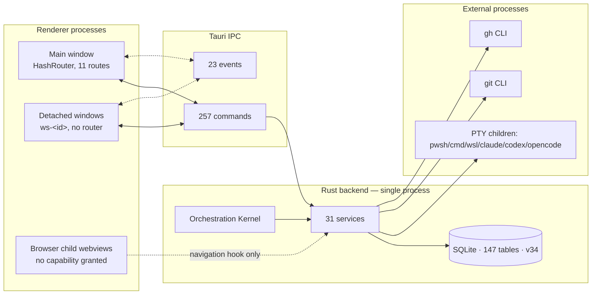

# 01 — Application Map

Repository cartography, technology stack, boot/shutdown architecture. All claims verified against implementation; confidence marked where runtime was not exercised.

---

## 1. What Paralith actually is (narrative)

Paralith is a Windows-first Tauri 2 desktop application whose central object is a **Workspace**: a saved arrangement of terminal panes bound to one Project (a Git working directory on disk). A user opens a folder, the app records it as a Project, and offers Workspace layouts holding 1–N panes. Each pane spawns a real PTY child process — a shell (`pwsh`, `cmd`, WSL) or a coding-agent CLI (`claude`, `codex`, `opencode`).

Everything else in the product hangs off that spine:

- A **right-hand tool panel** beside the terminal canvas hosts four singleton surfaces — Files (Monaco editor + explorer), Browser (native child webview), Diff (working-tree review), Agents (agent activity).
- **Full-screen routes** reached from the sidebar provide Repository Command Center (Git + GitHub), Database Studio (schema design), Memory (project knowledge), Swarms (multi-agent runs), Usage (Claude/Codex quota), Settings.
- A Workspace can be **detached into its own OS window**, moved between monitors, and reattached; a lease system guarantees only one window can type into a Workspace at a time.
- Background Rust services watch the filesystem, keep project knowledge fresh, schedule Swarm agents, and poll for signed updates.

There is **no LLM API client anywhere in the codebase**. Every AI action is a vendor CLI running in a PTY, with its stdout parsed as JSONL. This is a deliberate and consistently applied architectural decision (verified: no `api.anthropic.com`, no `api.openai.com`, no SDK dependency in `Cargo.toml` or `package.json`).

---

## 2. Repository root structure

```
Corelith-Official-Project-Repo/
├─ .github/workflows/        4 workflows (ci, release-stable, web-ci, video-ci)
├─ .worktrees/               7 local git worktrees (dev artefacts, not shipped)
├─ .jcode/dbstudio/          Database Studio design specs + handoff docs (not shipped)
├─ .agents/, .claude/        agent tooling config
├─ AGENTS.md (33 KB)         agent operating contract
├─ CLAUDE.md (33 KB)         engineering operating contract
├─ Paralith-Vault/           Obsidian knowledge vault, 16 sections (untracked)
├─ corelith-web/             Next.js marketing site (separate product)
├─ marketing/paralith-video/ Remotion product film (separate product)
└─ Paralith-tauri/           ◀ THE APPLICATION
```

`corelith-web`, `marketing`, `Paralith-Vault`, `.worktrees`, `.jcode` are **not part of the shipped desktop application**. Only `Paralith-tauri/` is.

---

## 3. Application tree — `Paralith-tauri/`

```
Paralith-tauri/
├─ index.html                app entry (inline theme bootstrap before mount)
├─ package.json              v0.4.14, 14 runtime deps
├─ vite.config.ts            main build
├─ vite.visual.config.ts     visual harness build
├─ src/                      FRONTEND — 311 files, 49,905 LOC
│  ├─ App.tsx                router, startup gate, update controller, theme runtime
│  ├─ screens/               11 route screens + RecoveryScreen + DetachedWorkspaceWindow
│  ├─ features/              15 feature modules (see §4)
│  ├─ components/            shell (AppShell), terminal (TerminalPane, PaneMenu), ui (6 primitives)
│  ├─ native/                IPC layer: commands.ts, events.ts, types.ts (1,285 LOC), windowContext.ts
│  ├─ stores/                appStore, sessionStore, activeContext, nativeOverlay
│  ├─ theme/                 5 themes, 151 tokens, registry, applyTheme, system-follow
│  ├─ shared/                layout helpers
│  └─ index.css              3,886 LOC monolithic stylesheet
├─ src-tauri/                BACKEND — 128 files, 89,267 LOC
│  ├─ src/lib.rs             866 LOC — AppState, setup(), 257-command handler, RunEvent teardown
│  ├─ src/build_info.rs      edition/identifier/updater gating
│  ├─ src/commands/          23 modules, 257 #[tauri::command] fns
│  ├─ src/services/          31 services (see §5)
│  ├─ src/database/          17 modules incl. migrations.rs (5,048 LOC), backup, legacy_migration
│  ├─ src/models/            25 typed domain modules
│  ├─ src/orchestration/     kernel, model, policy, redaction, registry
│  ├─ src/agents/            adapter (CLI arg construction), model_registry
│  ├─ src/errors/            AppError with code/layer/entity/detail
│  ├─ tauri.conf.json        base config (dev)
│  ├─ tauri.stable.conf.json / tauri.preview.conf.json   edition configs
│  └─ Cargo.toml             crate name `forgemind` (LEGACY NAME)
├─ release/                  version.json, changelogs, generated manifests, 2 minisign pubkeys
├─ scripts/
│  ├─ ci/                    run-checks.ps1, sweep-credentials.ps1
│  ├─ release/               19 scripts — build, assemble, publish, mirror, verify
│  └─ vault/                 Obsidian vault sync CLI (dev tooling)
├─ visual/                   browser-hosted harness rendering the REAL screens for screenshotting
├─ docs/                     MEMORY.md, CONTEXT_FABRIC.md, application-audit/ (this)
└─ design.md (34 KB)         design system reference
```

---

## 4. Frontend feature modules (15)

| Module | Responsibility | LOC (approx) |
|---|---|---|
| `code-surface/` | Files explorer, Monaco editor, tabs, quick-open, diff surface, agents surface, **browser/** subfolder | ~4,200 |
| `database/` | Database Studio UI — 7 sections, schema canvas, inspector, layout worker | ~4,000 |
| `memory/` | Memory workspace — overview, list, editor, inspector, graph, timeline, activity, review, search, context | ~3,600 |
| `repository/` | Repository Command Center — 19 components, selectors, nav, store | ~2,900 |
| `sidebar/` | Sidebar model/selectors/store/preferences, 16 components, attention + agent status | ~2,400 |
| `workspace-canvas/` | Pane docking, splitting, drag, resize, snap, geometry, persistence | ~2,300 |
| `swarms/` | Swarm create panel, overview, workspace, row menu, sidebar section, role pool editor | ~1,600 |
| `usage/` | Claude/Codex usage bar, page, charts, breakdown, cost, telemetry store | ~1,600 |
| `workspace-setup/` | Setup wizard: agent registry, allocation compiler, draft persistence, preset migration | ~1,200 |
| `workspace-windows/` | Placement selectors, handoff controller, close policy, monitor recovery, window intent | ~700 |
| `orchestrator/` | Orchestrator launcher overlay, api, store, types | ~700 |
| `terminals/` | Terminal runtime store (session fan-out), image input | ~600 |
| `updates/` | Update notification + controller | ~450 |
| `agent-resume/` | Agent resume center, events | ~350 |

---

## 5. Backend services (31)

| Service | LOC | Responsibility | Reachable from UI |
|---|---|---|---|
| `swarm_service` | 6,764 | Multi-agent engine + 900 ms scheduler thread | YES |
| `repository_service` | 4,436 | Git + GitHub CLI operations, queue, approvals | YES |
| `database_studio/*` | ~9,500 | Discovery, introspection, graph, design, diff, pipeline, health, context pack | YES |
| `terminal_manager` | 1,856 | PTY lifecycle, output pipeline, agent-state detection | YES |
| `knowledge_intelligence` | 1,949 | Deterministic candidate resolution, dedupe, conflicts, policy | YES |
| `context_compiler` | 1,621 | Retrieval + token packing over the Context Fabric | **Memory UI only** |
| `memory_service` | 1,571 | Memory items, revisions, claims, relations, sources | YES |
| `project_analyzer` | 1,568 | Deterministic project-shape walk | indirect (jobs) |
| `code_parser` | 1,282 | Symbol/import/reference extraction | **NO UI** |
| `knowledge_lifecycle` | 1,276 | Durable job queue + single worker thread | indirect |
| `update_service` | 1,266 | Update journal, download, verify, install, recovery | YES |
| `usage_service` | 1,264 | Claude/Codex quota via CLI | YES |
| `repository_intelligence` | 1,119 | Merge readiness, PR/workflow projection | YES |
| `filesystem_service` | 1,079 | Path-guarded project FS | YES |
| `window_registry` | 921 | Sessions, placements, leases, handoff, monitors | YES |
| `query_engine` | 883 | Structured knowledge query parsing | YES (`knowledge_parse_query`) |
| `file_watch_service` | 675 | Per-project watcher fan-out | YES (implicit) |
| `memory_markdown` | 652 | Markdown mirror of memories | indirect |
| `agent_resume` | 614 | Reconcile + resume prior agent sessions | YES |
| `agent_detector` | 601 | Detect installed Claude/Codex/OpenCode | YES |
| `browser_service` | 527 | Embedded child-webview browser | YES |
| `code_intelligence` | 488 | Code graph writes/queries | **NO UI** |
| `embeddings` | 477 | Embedding provider client | **NO UI** |
| `agent_handoff` | 476 | Run → structured handoff | indirect |
| `usage_telemetry_service` | 377 | System metrics + GitHub activity | YES |
| `restoration_scheduler` | ~350 | Restore terminal sessions on workspace open | YES |
| `semantic` | ~300 | Semantic index status/regen/nearest | **NO UI** |
| `project_service`, `startup_service`, `process_util`, `window_chrome` | small | support | mixed |

---

## 6. Technology stack — exact evidence

| Concern | Choice | Evidence |
|---|---|---|
| Desktop shell | Tauri 2.11.3 + `unstable` feature | `Cargo.toml:27` — comment states `unstable` is required for `Window::add_child` used by the embedded browser |
| Frontend framework | React 19.2.7 | `package.json:44` |
| Language | TypeScript ~6.0.2 | `package.json:63` |
| Build | Vite 8.1.1 | `package.json:64` |
| State | Zustand 5.0.14 | `package.json:48` |
| Routing | react-router-dom 7.18.2, **HashRouter** | `App.tsx:147` |
| Editor | `@monaco-editor/react` 4.7 + `monaco-editor` 0.54 | `package.json:33,43` |
| Terminal (UI) | `@xterm/xterm` 6.0 + fit/search/web-links addons | `package.json:38-41` |
| Terminal (native) | `portable-pty` 0.9.0 | `Cargo.toml:33` |
| Panels | `react-resizable-panels` 4.12.1 | `package.json:46` |
| Icons | `lucide-react` 1.24.0 | `package.json:42` |
| Database | `rusqlite` 0.40.1, `bundled` + `backup` features | `Cargo.toml:35` |
| Async | `tokio` 1.52 (rt-multi-thread, macros, sync, time) | `Cargo.toml:40` |
| Locks | `parking_lot` 0.12.5 | `Cargo.toml:32` |
| FS watching | `notify` 6.1 | `Cargo.toml:24` |
| HTTP | `reqwest` 0.13.4 (blocking + json) | `Cargo.toml:34` |
| Process discovery | `which` 8.0.4, `sysinfo` 0.39.6, `wait-timeout` 0.2.1 | `Cargo.toml:38,42,43` |
| Git | **CLI only** (`git`, `gh`) — no libgit2/git2-rs | verified: no git library in `Cargo.toml` |
| Browser | Tauri child webview (WebView2 on Windows) | `browser_service.rs:8` |
| Graph/canvas | **hand-rolled** — no d3/cytoscape/reactflow | `database/components/canvas/layoutCore.ts`, `memory/memoryGraphLayout.ts` |
| Testing (FE) | Vitest 4.1.10 + Testing Library + jsdom 29 | `package.json:59-65` |
| Lint | oxlint 1.71 (`--deny-warnings`) | `package.json:10` |
| Packaging | MSI + NSIS | `tauri.stable.conf.json` bundle.targets |
| Updater | `tauri-plugin-updater` 2.10.1 + minisign | `Cargo.toml:50`, `release/*.pubkey` |
| Signature verify (tests) | `minisign-verify` 0.2.5 (dev-dependency) | `Cargo.toml:56` |
| Logging | `tauri-plugin-log` 2, rotating 5 MB, KeepOne | `lib.rs:87-108` |
| Telemetry/analytics | **NONE** — no analytics SDK anywhere | verified by dependency audit |

**Notable absences (verified):** no LLM SDK, no state-machine library, no ORM, no CSS framework, no component library, no i18n, no error-reporting/crash SDK, no WebSocket server.

---

## 7. Boot sequence

`lib.rs::run()` — verified line-by-line.

```mermaid
flowchart TD
  A[OS launches PARALITH.exe] --> B[tauri::generate_context!]
  B --> C{debug build?}
  C -->|yes| C1[identifier := com.corelith.paralith.local-development<br/>updater DISABLED]
  C -->|no| C2[identifier := edition identifier<br/>updater plugin + minisign pubkey]
  C1 --> D[plugin: single-instance FIRST]
  C2 --> D
  D --> E[plugins: dialog, opener]
  E --> F[setup&#40;&#41;]
  F --> G[resolve app_data / app_config / app_local_data dirs]
  G --> H[legacy_migration: com.forgemind.workspace → com.corelith.paralith]
  H --> I[initialize rotating file logger]
  I --> J[apply_staged_restore — pending DB backup restore]
  J --> K[migration_preflight → schema_version, migration_required]
  K --> L[UpdateService::new — read update journal]
  L --> M{migration needed &&<br/>version>0 && !recovery}
  M -->|yes| N[create_pre_migration_backup]
  M -->|no| O
  N --> O[open_startup_database — run migrations to v34]
  O --> P{recovery_mode?}
  P -->|no| Q[repair_metadata — validate saved workspace metadata]
  P -->|yes| R
  Q --> R[construct 20 services into AppState]
  R --> S{recovery_mode?}
  S -->|no| S1[KnowledgeLifecycle.start&#40;&#41; — worker thread]
  S -->|no| S2[repository.recover_on_startup&#40;&#41;]
  S1 --> T
  S2 --> T[windows.hydrate_from_disk&#40;&#41;]
  T --> U[app.manage&#40;AppState&#41;]
  U --> V[updates.attach_app — broadcast to all windows]
  V --> W[rebuild detached workspace windows from placements]
  W --> X[updates.health_check_started&#40;&#41;]
  X --> Y[build main window from config + apply dark native chrome]
  Y --> Z[frontend mounts]
```



**Frontend startup (`App.tsx`):**
1. Inline `<head>` script paints the cached theme before React mounts (prevents flash).
2. `initThemeRuntime()` — reconcile persisted theme, follow OS, listen for cross-window `theme-changed`.
3. If `detachedWorkspaceId` (window label `ws-<id>`): render `DetachedWorkspaceWindow`, skip the router entirely.
4. Otherwise: `getStartupStatus()` → if `recoveryMode`, render `RecoveryScreen` and stop.
5. `getSettings()` → `terminalRuntime.start()` (subscribes to terminal events) → `confirmHealthyStartup()` → optional "What's new" banner → optional `checkForUpdates()`.
6. `HashRouter` mounts; `StartupWorkspaceRedirect` navigates to the last workspace **only if the hash is empty** (startup-only, deliberate).
7. `OrchestratorLauncher`, `AgentResumeCenter`, `UpdateNotification` mount as global overlays.

**Threads started automatically at boot:**

| Thread | Owner | Cadence |
|---|---|---|
| `swarm-scheduler` | `SwarmService` | 900 ms tick |
| knowledge worker | `KnowledgeLifecycle` | condvar + backstop sleep |
| file-watch dispatcher | `FileWatchService` | event-driven |
| per-terminal ×5 | `TerminalManager` | see `06-RUNTIME-AND-AUTOMATION.md` |

---

## 8. Shutdown sequence

`lib.rs:810-865`, verified.

| Event | Behaviour |
|---|---|
| `RunEvent::ExitRequested` | `perform_install(app, state, true)` — installs a staged update on exit; then `terminate_all_sessions()` |
| `RunEvent::Exit` | `terminate_all_sessions()` again (idempotent belt-and-braces) |
| Main window `Destroyed` | `terminate_all_sessions()`, close every detached window, `app_handle.exit(0)` — explicit full-application shutdown policy |
| Detached window `Destroyed` | `windows.forget_window(label)`, `file_watch.forget_window(label)`, `browser.close_for_window(label)`. **Terminals stay alive** so the Workspace can be reattached |

**Not explicitly torn down at exit:** the swarm scheduler thread (flag-based, process exits anyway), the knowledge worker, `notify` watchers, and the SQLite connection (dropped with the process). This is acceptable for process exit but means there is **no explicit DB checkpoint/close on shutdown** — confidence MEDIUM that this is safe under all crash paths, since WAL/journal mode was not verified at runtime.

---

## 9. Layered architecture



**Boundary facts:**
- Browser child webviews are granted **no Tauri capability** — even if a page calls `invoke`, the ACL denies it (`browser_service.rs:36-38`).
- Detached windows are blocked from administrative commands by `require_main_window()` (`lib.rs:72`).
- Workspace-scoped commands go through `validate_workspace_caller` / `assert_input_allowed` (lease check).
- Project-scoped commands go through `require_project_scope` — **duplicated in 6 command modules** (see `12-TECHNICAL-DEBT.md`).

---

## 10. Versions and identity

| Field | Value |
|---|---|
| npm package | `paralith` 0.4.14 |
| Rust crate | `forgemind` 0.4.14, lib `forgemind_lib` — **legacy name, never renamed** |
| Stable identifier | `com.corelith.paralith` |
| Preview identifier | `com.corelith.paralith.preview` |
| Legacy identifier (migrated from) | `com.forgemind.workspace` |
| Dev identifier | `com.corelith.paralith.local-development` |
| Schema version | 34 |
| MSRV | 1.77.2 |
| Thread name prefix | `forgemind-*` — **legacy naming still in shipped logs** |
