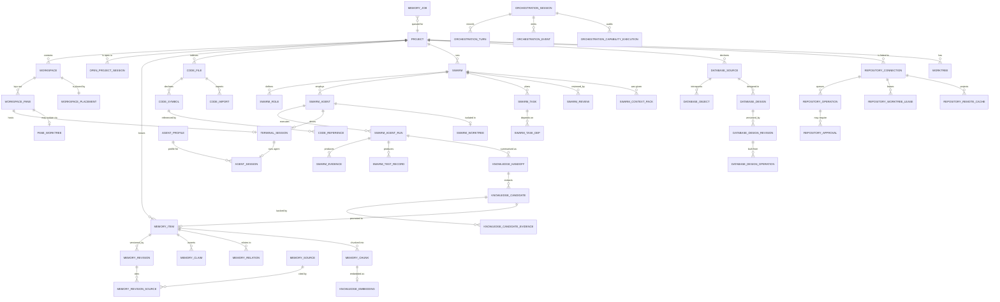

# 05 — Domain and Data Model

The persistence layer, the domain entities derived from it, and which module owns what.

---

## 1. Persistence architecture

| Property | Value | Evidence |
|---|---|---|
| Engine | SQLite via `rusqlite` 0.40.1, `bundled` (statically linked) | `Cargo.toml:35` |
| File | `<app_data_dir>/<DATABASE_FILENAME>` | `lib.rs:249`, `database/backup.rs` |
| Journal mode | **WAL, enforced** — startup fails if SQLite does not select WAL | `database/mod.rs:79-89` |
| Foreign keys | **ON**, set on every connection open | `database/mod.rs:66,104,117` |
| Maintenance | `PRAGMA wal_checkpoint(TRUNCATE); PRAGMA optimize;` | `database/mod.rs:153` |
| Schema version | tracked in `PRAGMA user_version`, current **34** | `database/mod.rs:144`, `migrations.rs:4` |
| Migration count | 32 functions (`migrate_v3` … `migrate_v34`) in one 5,048-LOC file | `migrations.rs` |
| Tables | **147 persistent** (148 `CREATE TABLE` statements; `terminal_sessions_rebuilt` is a rebuild scratch table renamed away in-migration) | `migrations.rs` |
| Indexes | **128** | `CREATE INDEX` count |
| Foreign-key clauses | **226** | `REFERENCES` count |
| `ON DELETE CASCADE` | **169** | — |
| JSON-blob columns (`*_json`) | **56 distinct** | see §6 |

### ⚠ The single-connection model

`DatabaseService` holds **one** `Mutex<Connection>` (`database/mod.rs:37`). There are **279 `connection.lock()` sites** across the backend.

Every one of the following serialises through that single mutex:
- all 257 Tauri commands
- the Swarm scheduler thread (ticks every 900 ms, per-swarm)
- the knowledge lifecycle worker thread
- the file-watch dispatcher
- per-terminal session recording and output-tail persistence
- Database Studio discovery/introspection (which walks the repository)

WAL provides no concurrency benefit here because there is only one connection — WAL's reader/writer concurrency requires *multiple* connections. This is the single most significant architectural constraint in the persistence layer. See `10-SECURITY-RELIABILITY-PERFORMANCE.md` §5.1.

**Confidence: HIGH** (structural), **MEDIUM** on user-visible impact (no runtime profiling performed).

---

## 2. Domain entities (derived from implementation)



**Root aggregate: `Project`.** Almost every table hangs off `projects(id)` with `ON DELETE CASCADE`, so deleting a Project is a single, complete operation.

---

## 3. Live tables by domain (106 tables)

### Core / identity (6)
`projects`, `workspaces`, `workspace_panes`, `workspace_placements`, `open_project_sessions`, `monitor_aliases`

### Terminals & agents (5 live)
`terminal_sessions`, `agent_profiles`, `agent_sessions`, `shell_profiles`, `pane_worktrees` — (`worktrees`, the bare table, is an ORPHAN: only `pane_worktrees` and `swarm_worktrees` are used)

### Settings & app (4)
`app_settings`, `schema_migrations`, `metadata_quarantine`, `migration_repair_history`

### Swarms (25)
`swarms`, `swarm_agents`, `swarm_agent_runs`, `swarm_tasks`, `swarm_task_deps`, `swarm_roles`, `swarm_role_allocations`, `swarm_runs`, `swarm_events`, `swarm_evidence`, `swarm_test_records`, `swarm_reviews`, `swarm_messages`, `swarm_decisions`, `swarm_attention_requests`, `swarm_worktrees`, `swarm_file_ownership`, `swarm_context_packs`, `swarm_presets`, `swarm_execution_defaults`, `swarm_command_drafts`, `swarm_lifecycle_history`, `swarm_recovery_states`, `swarm_runtime_sessions`, `swarm_runtime_event_receipts`, `swarm_canvas_connections`

### Memory / Context Fabric (14)
`memory_items`, `memory_revisions`, `memory_claims`, `memory_claim_sources`, `memory_sources`, `memory_revision_sources`, `memory_relations`, `memory_links`, `memory_chunks`, `memory_tags`, `memory_properties`, `memory_settings`, `memory_jobs`, `memory_events`*

### Knowledge intelligence (12)
`knowledge_candidates`, `knowledge_candidate_evidence`, `knowledge_conflicts`, `knowledge_entities`, `knowledge_entity_aliases`, `knowledge_project_facts`, `knowledge_fact_evidence`, `knowledge_handoffs`, `knowledge_timeline`, `knowledge_understanding`, `knowledge_context_cache`, `knowledge_embeddings`

### Code graph (5) — *written by backend, no UI*
`code_files`, `code_symbols`, `code_imports`, `code_references`, `code_index_state`

### Database Studio (13)
`database_sources`, `database_objects`, `database_source_evidence`, `database_object_provenance`, `database_snapshots`, `database_designs`, `database_design_revisions`, `database_design_operations`, `database_layouts`, `database_edges`, `database_issues`, `database_usage_refs`, `database_diffs`*

### Repository (11)
`repository_connections`, `repository_operations`, `repository_policies`, `repository_approvals`, `repository_worktree_leases`, `repository_remote_cache`, `repository_sync_cursors`, `repository_graph_nodes`, `repository_graph_edges`, `repository_graph_snapshots`, `repository_graph_index_state`

### Orchestration (4)
`orchestration_sessions`, `orchestration_turns`, `orchestration_events`, `orchestration_capability_executions`

### Usage v2 (3)
`ai_usage_snapshots`, `ai_usage_daily`, `ai_usage_file_checkpoints`

### Audit (1)
`audit_events`

\* `memory_events` and `database_diffs` are created but have **no code references** — listed here by domain but classified DEAD in §4.

---

## 4. Orphan tables — 44 of 147 (30%)

Verified by matching each `CREATE TABLE` name against every `.rs` file outside `migrations.rs`. Every hit was then contextualised — matches occurring only in prose comments or unrelated identifiers were rejected.

### Group A — Planned but never implemented (18)

| Table | Intended subsystem | Migration |
|---|---|---|
| `mcp_clients`, `mcp_permissions`, `mcp_audit`, `mcp_tasks`, `mcp_server_state` | MCP capability fabric | v34 |
| `bases`, `base_views` | "Bases" (structured knowledge views) | v34 |
| `canvases`, `canvas_nodes`, `canvas_edges` | Knowledge Canvas | v34 |
| `skills`, `skill_activations` | Skills | v34 |
| `knowledge_branch_merges` | branch knowledge reconciliation | v34 |
| `verification_profiles`, `verification_checks`, `verification_results` | verification framework | earlier |
| `project_contexts`, `project_context_suggestions` | project context suggestions | earlier |

The v34 migration header states these arrive "in one migration because they are one feature… no build ships with Bases but without the code graph." The code graph *was* implemented; Bases, Canvas, Skills and MCP were not.

### Group B — Legacy, superseded (16)

| Table | Superseded by |
|---|---|
| `usage_snapshots`, `usage_windows`, `usage_events`, `usage_limit_events`, `usage_profiles`, `usage_providers`, `usage_reset_observations`, `usage_alerts`, `usage_alert_prefs` (9) | `ai_usage_snapshots`, `ai_usage_daily`, `ai_usage_file_checkpoints` |
| `evidence_records`, `acceptance_criteria`, `task_acceptance_criteria`, `task_dependencies`, `task_events` (5) | `swarm_evidence`, `swarm_task_deps`, `swarm_events` |
| `missions`, `mission_sessions` (2) | Orchestration Kernel (itself a prototype) |

### Group C — Dead / never wired (9)

`agent_detections`, `memory_events`, `database_diffs`, `recovery_states`, `workspace_events`,
`repository_provider_accounts`, `repository_provider_installations`, `repository_webhook_deliveries`, `repository_recovery_checkpoints`

The three `repository_provider_*` / `repository_webhook_*` tables were designed for a GitHub App integration; the shipped implementation uses the `gh` CLI instead, so no code ever touches them.

`repository_recovery_checkpoints` is notable: `repository.recover_on_startup()` *detects* interrupted operations but the checkpoint table it would need to resume them is never written.

### The zombie: `mission_tasks`

`mission_tasks` has exactly **one** reference in the entire codebase:

```rust
// src-tauri/src/database/repository.rs:475
.query_row("SELECT id FROM mission_tasks WHERE id=?1", [id], …)
```

`append_repository_audit` validates an incoming `task_id` against `mission_tasks` before writing it to `audit_events`. Nothing populates `mission_tasks`, so the lookup **always returns `None`** and `valid_task` is **always `NULL`**.

**Consequence:** every repository audit row is written with `task_id = NULL`. The link between a repository operation and the task that caused it is silently discarded. This is classified **BROKEN**, not merely dead. Confidence: HIGH.

---

## 5. Table lifecycle ownership

| Domain concept | Source of truth (writer) | Readers | Conflicting owners |
|---|---|---|---|
| Project | `services/project_service.rs` | almost everything | none |
| Workspace + panes | `commands/workspace_commands.rs` → `database/mod.rs` | sidebar, canvas, restoration | none |
| Workspace placement / lease | `services/window_registry.rs` | window commands, sidebar | none — leases are runtime-only, never persisted (correct) |
| Terminal session | `services/terminal_manager.rs` | restoration, swarms, agents surface | **shared with `SwarmService`**, which calls `prepare_swarm_terminal` and drives sessions it does not own |
| Agent profile / detection | `services/agent_detector.rs` | setup wizard, swarms | none |
| Swarm aggregate | `services/swarm_service.rs` → `database/swarm.rs` | swarm UI, sidebar | none |
| Memory item / revision | `services/memory_service.rs` | context compiler, swarm context pack, markdown mirror | **`database/swarm.rs:326` reads `memory_items` directly**, bypassing `MemoryService` |
| Knowledge candidate / conflict | `services/knowledge_intelligence.rs` | memory review UI | none |
| Knowledge job queue | `services/knowledge_lifecycle.rs` | file watcher, swarm handoff | none |
| Code graph | `services/code_intelligence.rs` | **nothing** | none |
| Embeddings | `services/embeddings.rs` / `semantic.rs` | `knowledge_semantic_health` only | none |
| Database Studio graph | `services/database_studio/runtime.rs` | DB UI, context pack | none |
| Repository state | `services/repository_service.rs` | repository UI, per-pane git | **`commands/git_commands.rs` also shells out to `git` directly** (lines 365, 386, 595) |
| Repository intelligence | `services/repository_intelligence.rs` | repository UI | none |
| Orchestration session | `orchestration/kernel.rs` | orchestrator overlay | **conceptually overlaps `SwarmService`** |
| Update journal | `services/update_service.rs` | update UI, recovery screen, startup | none |
| Usage snapshots | `services/usage_service.rs` | usage UI | none |
| Settings | `commands/settings_commands.rs` | everything | none |

### Ownership conflicts found (3)

1. **Terminal sessions have two drivers.** `TerminalManager` owns PTY lifetime; `SwarmService` independently creates, monitors and terminates sessions for its agents (`prepare_swarm_terminal`, `focus_agent_terminal`, `stop_agent`). Both write to `terminal_sessions`. No corruption was found — `SwarmService` goes through `TerminalManager` for the actual spawn — but the *state machine* for an agent's terminal is split across two services.
2. **Memory has two readers with different semantics.** `MemoryService` + `ContextCompiler` implement ranked, budgeted retrieval; `database/swarm.rs::ensure_swarm_context_pack` issues its own raw SQL against `memory_items`/`memory_revisions`. The two will diverge in what they consider relevant.
3. **Git has two invocation paths.** `RepositoryService::run_program` (queued, cancellable, timed out, audited, redacted) and direct `Command::new("git")` calls in `commands/git_commands.rs`, `database/mod.rs:1870`, `services/agent_resume.rs`, `services/project_service.rs`. The direct calls bypass the operation queue and the audit ledger.

---

## 6. JSON-blob columns replacing structure (56)

56 distinct `*_json` columns exist. Representative examples:

| Column | Table | What is hidden |
|---|---|---|
| `payload_json` | `swarm_evidence` | **always `'{}'`** — see below |
| `metadata_json` | `audit_events` | operation metadata |
| `source_uris_json` | `swarm_context_packs` | citation list |
| `file_scope` (JSON array) | `repository_worktree_leases` | file ownership set |
| `payload` | `memory_jobs` | job arguments |
| `data` | `repository_remote_cache` | entire GitHub object |

This is a defensible trade in the caching/audit layers (`repository_remote_cache` genuinely stores opaque provider payloads) but it means several relationships are unqueryable in SQL — notably swarm file ownership and evidence content.

### 🔴 `swarm_evidence.payload_json` is never populated

```rust
// src-tauri/src/database/swarm.rs:1547
"INSERT INTO swarm_evidence(…,source_uri,payload_json,verified,created_at)
 VALUES(?1,?2,?3,?4,?5,?6,?7,?8,?9,'{}',?10,?11)"
```

The literal `'{}'` is bound in place of a parameter, and the Rust `SwarmEvidence` struct (`models/swarm.rs:1012-1024`) has **no payload field at all**. Every evidence row therefore carries an empty payload. The column is dead weight, and evidence is reduced to `title` + `summary` + `source_uri` strings.

**Impact:** the answer to *"what exactly proves this task succeeded?"* is a human-readable summary string, not structured, re-verifiable evidence. See `07-AGENTIC-SYSTEMS.md` §8.

---

## 7. Migration architecture

| Property | Finding |
|---|---|
| Location | one file, `database/migrations.rs`, **5,048 LOC** |
| Range | `migrate_v3` … `migrate_v34` (32 functions) |
| Baseline | v1/v2 are not present as functions — the earliest reachable migration is v3, so pre-v3 databases cannot be upgraded (they predate any shipped release; low risk) |
| Transactions | each migration wraps its batch in `BEGIN IMMEDIATE` with an explicit rollback on failure (verified in `migrate_v34`) |
| Version tracking | `PRAGMA user_version`, plus a `schema_migrations` table |
| Pre-flight | `migration_preflight()` reports `(version, migration_required)` **before** opening for write, so a backup can be taken first |
| Backup | `create_pre_migration_backup` runs when `migration_required && version > 0 && !recovery_mode` |
| Repair | `repair_metadata()` at every boot; failures quarantine rows into `metadata_quarantine` and log to `migration_repair_history` |
| Tests | migration tests assert `version == CURRENT_SCHEMA_VERSION` at several points (`migrations.rs:4090, 4437, 4502, 4590, 4672`) |

**Assessment:** the migration *machinery* is excellent — backup-before-migrate, transactional, repairable, tested. The *artefact* is a problem: a single 5,048-line file containing 32 migrations plus their tests is at the edge of maintainability, and it is where 43 dead tables were introduced and never removed.

---

## 8. Persistence gaps

| Concept | Persisted? | Note |
|---|---|---|
| Terminal PTY processes | ✅ metadata, ❌ process | Sessions are re-launched by `RestorationScheduler`, not resumed — scrollback beyond `output_tail` is lost |
| Editor open tabs / cursor | ❌ | `editorStore` is in-memory only; reopening a Workspace loses the editor state |
| Browser history / current URL | ◐ | `current_url` held in `BrowserView` (in-memory `Mutex`), plus a frontend store; **not written to SQLite** — a restart loses the page |
| Workspace tool panel state | ✅ | per-workspace store with persistence |
| Interactive lease | ❌ by design | "leases die with the process" (`models/placement.rs:118`) — correct |
| Swarm state | ✅ | fully durable including recovery states |
| Memory / knowledge | ✅ | fully durable with revisions and provenance |
| Orchestration session | ✅ | durable, but the state machine barely moves |
| Notification history | ❌ | no notification system exists |

---

## 9. Missing constraints and naming inconsistencies

| Finding | Evidence |
|---|---|
| Two naming conventions for the same concept | `swarm_task_deps` vs `task_dependencies` (legacy); `swarm_evidence` vs `evidence_records` (legacy) |
| Prefix inconsistency | `ai_usage_*` (v2) alongside `usage_*` (v1 legacy) — a reader cannot tell which is live from the name |
| `terminal_sessions_rebuilt` | a table-rebuild scratch table (`migrations.rs:55-65`); created, copied into, then `RENAME TO terminal_sessions`. Correct technique, but it means naive schema extraction over-counts by one. |
| Free-text status columns | `terminal_sessions.status`, `swarm_tasks.status`, `repository_operations.status` are `TEXT` with no `CHECK` constraint — typed enums exist in Rust but the database does not enforce them |
| `audit_events.mission_id` | column preserved for a table (`missions`) that is dead; always written `NULL` (`database/repository.rs:482`) |

---

## 10. Rust domain model modules (25)

`models/`: `agent`, `browser`, `code`, `context`, `database_studio`, `diagnostics`, `filesystem`, `git`, `graph`, `intelligence`, `knowledge`, `layout`, `memory`, `placement`, `project`, `query`, `repository`, `settings`, `swarm`, `terminal`, `update`, `usage`, `usage_telemetry`, `workspace`, `mod`.

Largest: `swarm.rs` (1,442 LOC, 40+ types), `repository.rs` (962), `database_studio.rs` (843), `intelligence.rs` (835).

All use `#[serde(rename_all = "camelCase")]` so the TypeScript boundary is consistent. `src/native/types.ts` (1,285 LOC) is the hand-maintained mirror — **there is no code generation**, so Rust and TypeScript types can drift silently. `npm run typecheck` catches TS-internal errors but cannot detect a Rust-side field rename.

**This is a real risk** and the main argument for introducing type generation (e.g. `ts-rs` or `specta`) before the surface grows further.
