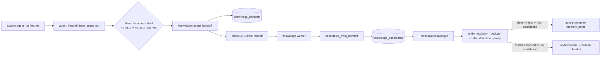
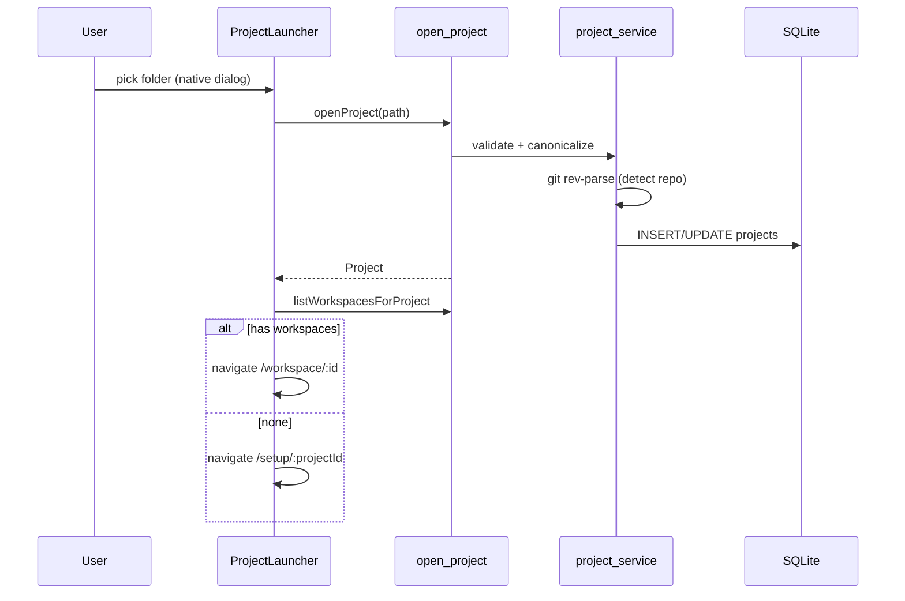
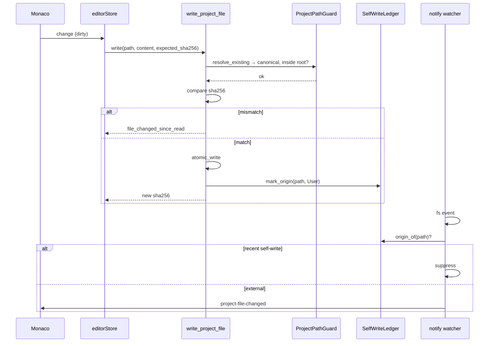
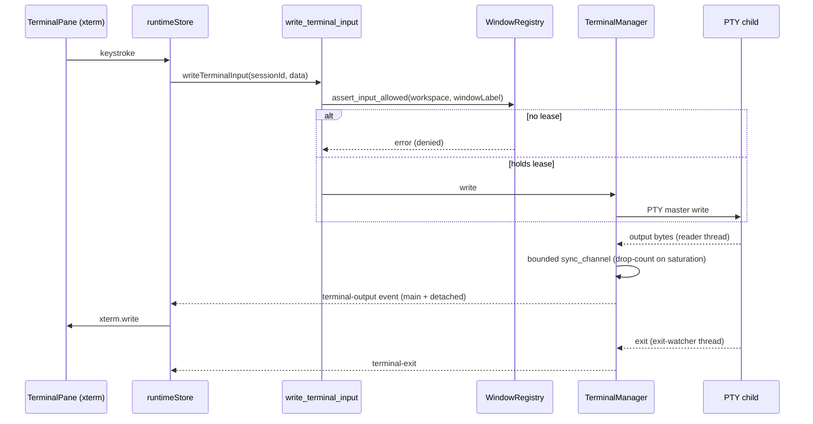
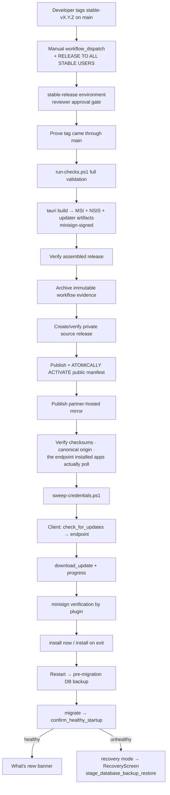

# 06 — Runtime and Automation

Startup, background threads, watchers, workers, events, polling, child processes — everything that happens without the user pressing a button.

---

## 1. Thread inventory

### 1.1 Application-lifetime threads (3)

| Thread | Started at | Cadence | Owner | Stop condition |
|---|---|---|---|---|
| `swarm-scheduler` | `SwarmService::new()` in `setup()` | 900 ms loop | `swarm_service.rs:1784` | `scheduler_running` AtomicBool |
| knowledge worker | `KnowledgeLifecycle::start()` (skipped in recovery mode) | condvar-driven + `MAX_IDLE` backstop sleep | `knowledge_lifecycle.rs:129` | flag |
| file-watch dispatcher | `FileWatchService::new()` | event-driven (`notify`) | `file_watch_service.rs:223` | per-window `forget_window` |

### 1.2 Per-terminal-session threads — **5 per session**

Every terminal pane spawns five OS threads (`terminal_manager.rs`):

| # | Thread name | Line | Purpose | Cadence |
|---|---|---|---|---|
| 1 | `forgemind-agent-identity-<id>` | 411 | Discover the provider's own session id for later resume | up to 80 polls |
| 2 | `forgemind-output-pipeline-<id>` | 506 | Drain the bounded output channel and emit to windows | blocking `recv()` |
| 3 | `forgemind-pty-output-<id>` | 554 | Read the PTY master into `OUTPUT_BUFFER_SIZE` chunks | blocking read |
| 4 | `forgemind-pty-exit-<id>` | 625 | `try_wait()` on the child | **100 ms poll** |
| 5 | `forgemind-agent-state-<id>` | 712 | Classify agent working/idle/waiting | **5 s poll** |

**Scaling consequence:** a 4-pane Workspace = 20 threads. Four open Workspaces = 80 threads. Add the Swarm agents (one PTY each) and a heavy session can approach 100+ OS threads. Thread #1 terminates after its poll budget; #4 and #5 run for the session's lifetime. See `10-SECURITY-RELIABILITY-PERFORMANCE.md` §5.2.

**Naming note:** all five carry the legacy `forgemind-` prefix and appear that way in shipped logs and debuggers.

### 1.3 Transient threads

| Thread | Owner | Purpose |
|---|---|---|
| stdout/stderr readers (×2 per process) | `repository_service.rs:2946-2947` | bounded reads from `git`/`gh` |
| detection probes | `agent_detector.rs:111` | scoped parallel provider probe |
| usage reader | `usage_service.rs:883` | read Codex app-server responses |
| terminate worker | `terminal_manager.rs:941` | asynchronous session teardown so close never blocks the UI |
| approval/progress emitter | `repository_service.rs:4167` | operation progress fan-out |

---

## 2. Background automation pipelines

### 2.1 Change → impact → staleness (the flagship loop)

```mermaid
flowchart LR
  A[File saved / branch switched] --> B[notify watcher]
  B --> C{SelfWriteLedger<br/>origin check}
  C -->|Paralith's own write| X[suppressed]
  C -->|external / user| D[handle_changed_paths]
  D --> E{is_knowledge_relevant?}
  E -->|no| X
  E -->|yes| F[enqueue AnalyzeImpact<br/>dedup key: project]
  F --> G[(memory_jobs)]
  G --> H[knowledge worker thread]
  H --> I[impact report]
  I --> J[staleness_decision&#40;&#41;<br/>PURE: no db, no clock, no model]
  J --> K[memory_mark_stale]
  J --> L[refusals recorded with reasons]
  K --> M[emit memory-knowledge-updated]
  M --> N[Memory UI refresh]
```



**Design guarantees, all verified in `knowledge_lifecycle.rs:1-100`:**
- Nothing runs on the UI thread or the watcher thread — the watcher only inserts a row.
- The queue **coalesces**: repeated saves merge into the one pending job per Project.
- `MAX_PATHS_PER_JOB` bounds a branch switch that touches thousands of files; the remainder is covered by the *next* change, because "a staleness sweep that takes minutes is worse than one slightly behind".
- `staleness_decision()` is a pure function returning both what it flagged **and what it refused to flag, with reasons** — auditable automatic writes.
- The worker starts at boot, not on Project open, so a job left `retrying` by a crash is picked up even if that Project is never reopened.

**Status: COMPLETE · HIGH confidence.** This is the best-engineered subsystem in the repository.

### 2.2 Project shape analysis

```
manifest/config file changed  →  AnalyzeProject job (dedup: one per project)
                              →  project_analyzer.rs deterministic walk
                              →  knowledge_project_facts + knowledge_understanding
```
Only **shape-changing paths** re-trigger this (`knowledge_lifecycle.rs:63` — "walking a monorepo on every save is exactly the behaviour this system must not have"). Reopening a Project three times in a minute queues **one** walk.

### 2.3 Agent handoff → durable knowledge



**Critical asymmetry:** this fires only from `swarm_service.rs:4311`. An agent the user launches manually in a terminal pane produces **no handoff and no knowledge**, even though it does the same work.

### 2.4 Code graph incremental indexing

```
file change  →  FileWatchService (with_code_intelligence)
             →  CodeIntelligence  →  code_parser  →  code_files/symbols/imports/references
             →  code_index_state
```
Runs automatically and correctly. **No consumer.** No UI reads it; no agent receives it.

### 2.5 Database Studio re-discovery

`FileWatchService::with_database_studio` invalidates Database Studio's cached graph when schema/migration files change.

### 2.6 Repository remote projection

| Trigger | Interval |
|---|---|
| `RepositoryCommandCenter.tsx:90` | 120 s, guarded by `projectId` still matching |
| manual refresh | user action |

Writes `repository_remote_cache` + `repository_sync_cursors`; emits `repository-sync-health`.

### 2.7 Update polling

| Trigger | When |
|---|---|
| Post-safe-startup one-shot | `App.tsx:109`, gated on `automaticUpdateChecks` |
| Periodic | `App.tsx:119` — **45 minutes**, primary window only, gated on non-recovery startup |
| Manual | Settings → Updates |

The Rust coordinator owns check state and rejects overlapping checks, so the timer only nudges it.

### 2.8 Terminal session restoration

`RestorationScheduler` restores sessions when a Workspace opens, bounded by `restoration_launch_budget` (default 4) and protected by a **circuit breaker** (`reset_restoration_circuit`). Emits `restoration-progress`.

### 2.9 Swarm scheduling

The 900 ms scheduler calls `tick_all_schedulable()` → per-swarm `tick()` under a per-swarm operation lock, respecting `global_active_limit`. A failed tick logs and continues.

### 2.10 Monitor recovery sweep

`MonitorRecoveryWatcher.tsx` polls `recover_workspace_windows` to bring back windows stranded on a disconnected display.

### 2.11 Automatic at startup (no user action)

Legacy profile migration · staged DB restore · pre-migration backup · schema migration to v34 · metadata repair · repository interrupted-operation inspection · window registry hydration · detached window rebuild · update health check · knowledge worker start · swarm scheduler start · optional last-workspace redirect · optional update check.

---

## 3. Polling inventory

| Location | Interval | Purpose |
|---|---|---|
| `swarm_service.rs:1798` | 900 ms | swarm scheduler |
| `terminal_manager.rs:~630` | 100 ms | child exit watch (per session) |
| `terminal_manager.rs:713` | 5 s | agent state (per session) |
| `repository_service.rs:2975` | 25 ms | `git`/`gh` process wait |
| `swarm_service.rs:1096` | 100 ms | (scheduler-adjacent wait) |
| `AiUsageStatusBar.tsx:90` | 30 s | reset-countdown clock tick (UI only) |
| `UsageInstrument.tsx:51` | 30 s | clock tick (UI only) |
| `RepositoryCommandCenter.tsx:90` | 120 s | remote projection refresh |
| `MonitorRecoveryWatcher.tsx:52` | configurable | monitor sweep |
| `App.tsx:119` | 45 min | update check |

**Assessment:** frontend polling is restrained and appropriate. The two hot loops are the per-session 100 ms exit watcher (unavoidable with `portable-pty`'s API) and the 25 ms process-wait spin in `repository_service` (a `wait-timeout`-based wait would be cheaper — the crate is already a dependency).

---

## 4. Event matrix

23 events. **Producers verified in Rust; consumers verified by `listen()` sites in `src/`.**

| Event | Producer | Consumer(s) | Payload | Scope |
|---|---|---|---|---|
| `terminal-output` | `terminal_manager.rs:1089,1094` | `terminals/runtimeStore.ts` | session id + bytes + sequence | main + detached |
| `terminal-status` | `terminal_manager.rs:672,673` | `runtimeStore.ts` | session status | main + detached (explicit dual emit) |
| `terminal-exit` | `terminal_manager.rs:674,675` | `runtimeStore.ts` | session id + exit code | main + detached |
| `agent-state` | `terminal_manager.rs:1330,1335` | `WorkspaceScreen`, `AgentsSurface`, sidebar | `AgentStateEvent` | main + detached |
| `restoration-progress` | `restoration_scheduler.rs:230` | workspace screen | progress | main |
| `project-file-changed` | `file_watch_service.rs:36` | `code-surface` editor/explorer | changed paths | per-window |
| `memory-knowledge-updated` | `models/knowledge.rs:200` | `memory/api.ts` | project id | broadcast |
| `swarm-changed` | `swarm_service.rs:4802` | `swarms/swarmStore.ts` | swarm id | broadcast |
| `browser-event` | `browser_service.rs:15` | `BrowserSurface` | navigation / inspect payload | owning window |
| `repository-state-changed` | `repository_service.rs` | `repositoryStore.ts` | project id | broadcast |
| `repository-operation-progress` | `repository_service.rs` (×2) | `repositoryStore.ts` | operation progress | broadcast |
| `repository-approval-required` | `repository_service.rs` | `repositoryStore.ts` | approval | broadcast |
| `repository-approval-decision` | `repository_service.rs` | `repositoryStore.ts` | decision | broadcast |
| `repository-sync-health` | `repository_service.rs` | `repositoryStore.ts` | sync health | broadcast |
| `orchestrator-session` | `orchestration/kernel.rs:39` | `orchestrator/api.ts` | session snapshot | broadcast |
| `orchestrator-event` | `orchestration/kernel.rs:40` | `orchestrator/api.ts` | timeline entry | broadcast |
| `update-status` | `update_service.rs:27` | `updates/updateController.ts` | `UpdateStatus` | all windows |
| `update-progress` | `update_service.rs:29` | `updateController.ts` | bytes/total | all windows |
| `workspace-attach-requested` | `window_commands.rs:249` | `App.tsx:60` | `HandoffTicket` | targeted window |
| `theme-changed` | `settings_commands.rs` | `theme/themeStore.ts` | theme id | all windows |
| `sidebar-preferences-changed` | `settings_commands.rs` | `native/events.ts` | preferences | all windows |
| `ai-usage-changed` | `usage_commands.rs` | `usage/aiUsageStore.ts` | snapshots | broadcast |
| **`repository-intelligence-updated`** | `repository_commands.rs:449` | **NONE** | project id | broadcast |

### Event findings

1. **`repository-intelligence-updated` is a dead event.** Emitted, never listened to. The Intelligence section consequently does not live-update. **DEAD · HIGH confidence.**
2. **No listener leaks found.** Every `listen()` site in `src/` follows the correct pattern: the promise resolves to an `unlisten` fn which is called on cleanup, with a `cancelled` guard for the unmount-before-resolve race (`App.tsx:60` is the canonical example). This is a genuinely well-executed detail.
3. **Terminal events use explicit dual `emit_to`** (main window label + detached label) rather than a global broadcast, so a detached window receives its own terminal stream without every window paying for it.
4. **Most other events are global broadcasts.** `swarm-changed`, `memory-knowledge-updated`, `repository-*` fan out to every window regardless of what it displays. With several detached windows open this is redundant work, though payloads are small (usually just an id).
5. **No ordering guarantees are asserted anywhere.** Consumers refetch authoritative state on receipt rather than applying event payloads as deltas — this is the correct choice and makes ordering irrelevant. Verified in `repositoryStore.ts`, `swarmStore.ts`, `memoryStore.ts`.

---

## 5. Child-process inventory

| Process | Spawned by | Args | CWD | Capture | Timeout | Cancel | Cleanup |
|---|---|---|---|---|---|---|---|
| Shell (`pwsh`/`cmd`/WSL) | `terminal_manager.rs:250` | argv array from shell profile | pane working dir | PTY stream | none (interactive) | user | exit watcher + `terminate_all_sessions` |
| Claude / Codex / OpenCode CLI | `terminal_manager.rs:250` via `agents/adapter.rs` | provider-specific argv incl. permission mode / sandbox | project root or worktree | PTY stream (machine protocol) | none | user / swarm stop | as above |
| `git` | `repository_service.rs:2897` (queued) | argv array | repo/worktree | piped, `read_bounded` | `DEFAULT_TIMEOUT_SECONDS` | `AtomicBool` | `terminate_child` |
| `git` (direct) | `git_commands.rs:365,386,595`, `database/mod.rs:1870`, `agent_resume.rs:466,598`, `project_service.rs:156` | argv array | varies | piped | ad hoc | **none** | process exit |
| `gh` | `repository_service.rs:2858` | argv array | repo | piped, JSON parsed | as above | `AtomicBool` | `terminate_child` |
| `gh` (telemetry) | `usage_telemetry_service.rs:311` | argv array | — | piped | yes | no | wait |
| `codex app-server` | `usage_service.rs:844` | `-s read-only -a untrusted app-server` | — | stdin/stdout JSON | yes | kill on error | `kill` + `wait` |
| provider version probes | `agent_detector.rs:49,343,410` | `--version` | — | piped | yes | no | wait |
| Windows detached-console flag | `process_util.rs:11` | `creation_flags(0x08000000)` = `CREATE_NO_WINDOW` | — | — | — | — | prevents console flash |

**No shell interpolation anywhere.** Every spawn passes an argv array; no `sh -c`, no `cmd /c` with a composed string. Verified across all 14 spawn sites.

### Process-leak assessment

| Path | Leak risk |
|---|---|
| Terminal sessions | **LOW** — `terminate_all_sessions()` on `ExitRequested`, on `Exit`, and on main-window destroy; detached-window close deliberately preserves them (documented policy) |
| Queued `git`/`gh` | **LOW** — timeout + cancellation both call `terminate_child` and join reader threads |
| Direct `git` calls | **MEDIUM** — no cancellation, ad-hoc timeouts; a hung `git` in `agent_resume` or `project_service` would block its caller |
| `codex app-server` | **LOW** — explicit `kill`+`wait` on every error branch |
| Swarm agent PTYs | **LOW** — `stop_agent`, `prepare_project_close`, and the global terminate all cover it |
| **Detached-window terminals after main-window crash** | **UNKNOWN** — if the main window is destroyed the handler kills everything; if the *process* crashes, PTY children are orphaned. Not verifiable statically. |

---

## 6. Data-flow diagrams

### 6.1 Project opening



### 6.2 File editing



### 6.3 Terminal execution



### 6.4 Application update



### 6.5 Notification / activity flow

There is **no notification system**. The closest equivalents:

```
agent-state event   →  sidebarAgentStatus  →  sidebarAttention  →  WorkspaceRuntimeIndicator
swarm attention     →  swarm_attention_requests  →  SwarmsSidebarSection
update-status event →  UpdateNotification banner
knowledge updated   →  MemoryActivity feed (Memory route only)
repository events   →  OperationLedger (Repository route only)
```

Each is a private channel into one surface. Nothing aggregates them, nothing persists an unread state, and nothing reaches the user when the relevant route is not open.

---

## 7. Automation gaps

| Gap | Evidence |
|---|---|
| Non-Swarm agent runs produce no knowledge | handoff only fires from `swarm_service.rs:4311` |
| Code graph is maintained but never consumed | 8 commands, 0 callers |
| Semantic index is never regenerated automatically | `semantic_regenerate` has no caller and no scheduled trigger |
| Repository intelligence does not live-update | its event has no listener |
| Interrupted repository operations are detected but not resumed | `repository_recovery_checkpoints` never written |
| No scheduled maintenance | no automatic `VACUUM`, log pruning, cache eviction or orphan-row cleanup was found |
