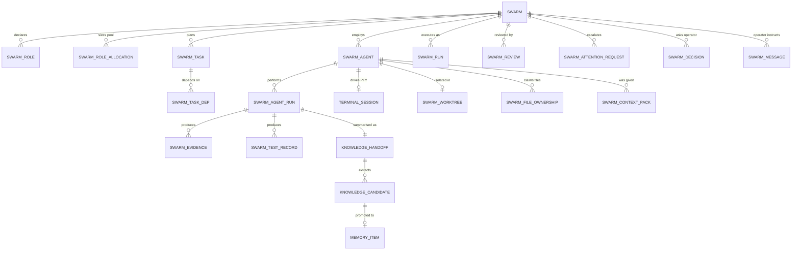
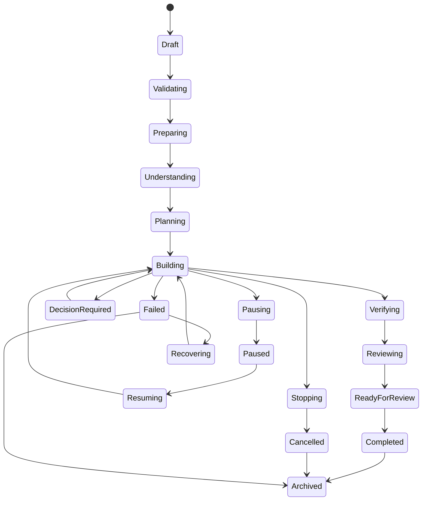

# 07 — Agentic Systems

Agents, swarms, tasks, evidence, review, memory and context delivery. This is the document that answers *what Paralith's AI layer actually does today*.

---

## 1. The foundational fact

**Paralith contains no LLM API client.** There is no Anthropic SDK, no OpenAI SDK, no HTTP call to any model endpoint, and no API key handling anywhere in the codebase. Verified by dependency audit of `Cargo.toml` and `package.json`, and by exhaustive search for provider hostnames.

Every AI capability works exactly one way:

```
Paralith spawns a vendor CLI in a PTY
  →  passes a constructed argv (never a shell string)
  →  the CLI does the model work and streams JSONL to stdout
  →  Paralith parses that JSONL into typed runtime events
  →  Paralith persists those events as domain state
```

This is a coherent, deliberate architecture. It means Paralith never holds a model credential, inherits each vendor's own permission and sandbox model, and can support a new provider by writing an adapter rather than an integration.

It also means **Paralith's agentic intelligence is bounded by what it can put on a command line and read back from stdout.**

---

## 2. Providers

| Provider | Terminal pane | Swarm runtime | Usage tracking | Session resume |
|---|---|---|---|---|
| **Claude Code** | ✅ | ✅ | ✅ | ✅ |
| **Codex CLI** | ✅ | ✅ | ✅ | ✅ |
| **OpenCode** | ✅ (incl. `.ps1` npm shim handling) | ❌ | ❌ | ❌ |

`SwarmRuntimeKind` is `Claude | Codex | Auto`. OpenCode is a terminal-launchable agent only.

### 2.1 Claude adapter (`swarm_service.rs:181-255`)

```
claude --print
       --model <model>
       --effort <effort>
       --verbose
       --output-format stream-json
       --permission-mode <acceptEdits | plan>
       [--resume <session_id>]
       --allowedTools "Bash(npm test*),Bash(cargo test*),…22 test-runner patterns…"
       --disallowedTools "Edit,Write,NotebookEdit,Task,EnterWorktree,ExitWorktree"
```

- `--permission-mode` is derived from `agent.role.may_write_code()`: writers get `acceptEdits`, non-writers get `plan`. The code comments that `plan` mode is interactive and refuses verification commands — a real understood trade-off.
- `--allowedTools` whitelists **22 specific test-runner invocations** across Bash and PowerShell. This is how a reviewer/verifier agent is allowed to run tests but nothing else.
- `--disallowedTools` explicitly blocks file mutation and sub-agent spawning for non-writing roles.

### 2.2 Codex adapter (`swarm_service.rs:256-320`)

```
codex exec [resume]
      --model <model>
      -c model_reasoning_effort=<effort>
      --ask-for-approval never
      --sandbox <workspace-write | read-only>
      --cd <working_directory>
      --json
      --skip-git-repo-check
```

`--sandbox` mirrors the same `may_write_code()` decision. `--ask-for-approval never` is correct for headless execution — approval is Paralith's job, enforced upstream by the repository approval policy and the role's sandbox mode.

**Assessment: this is careful, security-aware provider integration.** Both adapters use the vendor's own permission primitives rather than trusting the agent to behave.

---

## 3. The two agent execution paths

Paralith has **two entirely separate ways to run an agent**, with different capabilities:

| | Path A — Terminal pane | Path B — Swarm |
|---|---|---|
| How it starts | User assigns a provider to a pane in the setup wizard | `start_swarm` → scheduler claims a task → spawns an agent |
| Prompt | **none** — the user types | constructed `runtime_instruction()` |
| Memory context | **none** | 8 memory items |
| Structured output parsing | agent-state heuristics only | full JSONL normalisation |
| Task graph | none | `swarm_tasks` + dependencies |
| Worktree isolation | manual (`create_isolated_pane_worktree`) | automatic per agent |
| Evidence | none | `swarm_evidence`, `swarm_test_records` |
| Review | none | `swarm_reviews` |
| **Produces knowledge** | **NO** | **YES** (handoff → candidates) |
| Resume | `resume_agent_session` | built into the adapter |

**This asymmetry is the single largest product-coherence issue in the agentic layer.** The user's most common action — "put Claude in a pane and work" — is the one that feeds nothing back into the system. Everything Paralith learns, it learns from Swarms.

---

## 4. Domain model



**Roles (6):** `Coordinator`, `Scout`, `Builder`, `Debugger`, `Reviewer`, `Integrator`.
Role capability sets are declared explicitly, e.g. `Integrator => ["read_project", "integrate_verified_changes", "run_tests"]` (`swarm_service.rs:4999`).

---

## 5. ⚠ Context delivery — the critical finding

> **Phase 15 question: when an agent starts a task today, what exactly does Paralith provide it?**

### 5.1 The answer

For a **Swarm agent**, the entire context is `runtime_instruction()` (`swarm_service.rs:1639-1673`):

1. **Identity + task**: `"You are {display_name}, the {role} assigned to task: {task.title}."`
2. **Mission**: the Swarm's free-text mission string.
3. **Working-directory contract**: the canonical project root, plus explicit instructions not to `cd`, pipe, or redirect verification commands.
4. **Behavioural rules**: follow repository instructions and approval policy; **do not push or perform remote Git operations**; produce real changes and verification; report blockers truthfully; finish only when verified.
5. **Persisted operator instructions**: up to 20 messages from `swarm_messages` targeted at `@swarm`, this agent, or this role.
6. **Memory context**: up to **8** memory items, each as `"- {title}: {summary truncated to 900 chars}"`, prefixed with a caution that provenance is persisted but the agent should verify against the repository.

For a **terminal-pane agent**: nothing. The provider CLI starts in the project directory and the user types.

### 5.2 How those 8 memories are chosen

```sql
-- src-tauri/src/database/swarm.rs:326-351
SELECT item.id, revision.id, item.title, item.memory_type, item.state,
       CASE WHEN trim(revision.summary)<>'' THEN revision.summary
            ELSE substr(revision.body,1,1200) END,
       revision.confidence
FROM memory_items item
JOIN memory_revisions revision ON revision.id = item.current_revision_id
WHERE item.project_id = ?1 AND item.state <> 'archived'
ORDER BY item.pinned DESC, item.updated_at DESC
LIMIT 8
```

**There is no relevance ranking of any kind.** Not to the task, not to the role, not to the files involved, not to the mission. The selection is "8 most recently updated non-archived memories, pinned first". A memory about the CI pipeline will be handed to an agent fixing a CSS bug if it happens to have been edited recently.

### 5.3 What is bypassed

Paralith contains **three** knowledge-retrieval systems. The agent uses the crudest one.

| System | LOC | Capability | Reaches an agent? |
|---|---|---|---|
| **`ContextCompiler`** (`services/context_compiler.rs`) | 1,621 | Retrieval, ranking, **token budgeting**, citations, staleness handling — purpose-built for this exact job | ❌ **only `MemoryContext.tsx`, a human preview panel** |
| **Semantic index** (`embeddings.rs` + `semantic.rs` + `knowledge_embeddings`) | ~800 | Vector nearest-neighbour over memory chunks; designed to "contribute candidates, never rerank a deterministic result" (`lib.rs:41`) | ❌ no caller at all |
| **Code graph** (`code_parser.rs` + `code_intelligence.rs` + 4 tables) | ~2,400 | Symbols, imports, references, `code_impact` — could answer "what code does this task touch?" | ❌ no caller at all |
| **`ensure_swarm_context_pack`** (`database/swarm.rs:326`) | ~50 | `ORDER BY updated_at DESC LIMIT 8` | ✅ **this is what agents get** |

`ContextCompiler`'s only caller is `memoryStore.ts:634` ← `MemoryContext.tsx:86` — a panel where a human can look at what a context pack *would* contain. It is never handed to a process.

### 5.4 Why this matters most

Paralith's stated product thesis is that agents should "reason from typed evidence rather than transcript history". The typed evidence exists — provenance, claims, sources, confidence, staleness, a symbol graph, an embedding index. **None of it is delivered.** What reaches the model is eight recently-edited summaries and a mission string.

The distance between the built capability and the delivered capability here is larger than anywhere else in the product — and closing it is comparatively cheap, because both ends already exist and are tested. One call site in `swarm_service.rs:1026` currently reads:

```rust
let memories = self.database.ensure_swarm_context_pack(&swarm, task, agent)?;
```

**Priority: P0. Confidence: HIGH.**

### 5.5 What *is* recorded correctly

`swarm_context_packs` persists exactly which memory revision, with which confidence and which source URIs, was given to which agent for which task. **Context provenance is durable even though context selection is naive.** That is the right half of the problem to have solved first — the audit trail is ready for a better selector to be dropped in.

---

## 6. Evidence and proof

> **Phase 13 question: how does Paralith currently decide that an AI task actually succeeded?**

### 6.1 The mechanism

1. The agent CLI emits JSONL to its PTY.
2. `structured_json_records()` recovers complete JSON objects from the transcript — ConPTY control sequences are stripped, resize-induced line breaks are healed, and only well-formed objects are accepted.
3. `normalize_codex_event()` / `normalize_claude_event()` **whitelist** which event types become domain events.
4. Each event is keyed `sha256(source_line):offset`, giving idempotent delivery (`swarm_runtime_event_receipts`).
5. A `completed` or `failed` event marks `provider_finished`.
6. Test commands are recognised by `is_test_command()` (13 runners) and recorded in `swarm_test_records`.
7. Evidence rows are written to `swarm_evidence` with a `verified` flag.

### 6.2 The production completion gate — stronger than expected

A task reporting `succeeded` does **not** complete on the agent's word alone. `completion_gate_failure()` (`swarm_service.rs:4208-4245`) runs on every success in production and can veto it:

| Role | Requirement to complete |
|---|---|
| **Integrator** | must have a `swarm_test_records` row for this task with `status == "passed"` |
| **Builder**, if the task title contains `test` / `verify` / `regression` | same requirement |
| **Reviewer** | must have its *own* passing test record **and** a `swarm_evidence` row authored by that agent with `verified == true` |
| all others | no test requirement |

Failure messages are specific and honest — `"{task} ended without a persisted passing verification command"`, `"Independent review ended without a verified Reviewer trace"`.

The gate is applied only when `runtime.requires_persisted_verification()` is true. The trait default is `true` (`swarm_service.rs:77`) and `ProductionAgentRuntime` does not override it. The only implementation returning `false` is `SimAdapter`, which is `#[cfg(test)]`-gated. **The simulated-evidence branch at `swarm_service.rs:3998` therefore cannot execute in a shipped build.** Verified.

Likewise `verified: true` at `swarm_service.rs:607` is attached to `evidence_type: "git_commit"` with `source_uri: "git:<commit_sha>"` — an assertion that a specific commit exists, which is independently checkable. That is a legitimate use of the flag.

**This is real proof machinery.** It is the strongest "did it actually work?" implementation the audit found.

### 6.3 Where success can still be falsely reported

| # | Route | Severity |
|---|---|---|
| 1 | **Evidence payloads are never stored.** `INSERT INTO swarm_evidence(…,payload_json,…) VALUES(…,'{}',…)` — the literal `'{}'` is hardcoded (`database/swarm.rs:1547`) and `SwarmEvidence` has no payload field. Evidence is reduced to `title` + `summary` + `source_uri` strings. **The gate above checks that evidence *exists*, not what it contains** — nothing can be re-verified after the fact. | **HIGH** |
| 2 | **The Builder test requirement is title-heuristic.** A Builder task only needs a passing test if its *title* happens to contain `test`, `verify` or `regression` (`swarm_service.rs:4216-4219`). A task called "Fix the login redirect" completes with no verification requirement at all. | **HIGH** |
| 3 | **Test pass/fail comes from the provider's event stream.** `is_test_command()` recognises that a test command was *invoked*; the outcome is the agent's own report of it. Paralith does not independently re-run the command and compare exit codes. | **MEDIUM** |
| 4 | **`SwarmRuntimeKind::Auto` normalises nothing.** `SwarmRuntimeKind::Auto => {}` (`swarm_service.rs:1165`) produces zero events, so an `Auto` agent can neither report completion nor satisfy the gate. | **MEDIUM — classified BROKEN** |
| 5 | **`accept_result` allows manual override.** Correct and desirable, but combined with (1) there is no durable record of *what* was accepted beyond summary text. | **LOW** |
| 6 | **A second, richer evidence model is dead.** `evidence_records`, `acceptance_criteria`, `task_acceptance_criteria` exist in the schema with a fuller shape and are entirely unused — the intended design appears to have been replaced by the simpler one. | **INFO** |

### 6.4 Verdict

Paralith's answer to "did this succeed?" is: **"the provider's event stream reported completion, and — for Integrator, test-named Builder, and Reviewer tasks — a passing test record and a verified evidence row are persisted, or the task fails."**

That is genuinely evidence-based and better than most comparable systems. The two gaps that matter are that the evidence *content* is discarded (`payload_json = '{}'`) and that the requirement to have evidence at all depends on a task-title substring match.

---

## 7. ⚠ The Orchestration Kernel

### 7.1 What it claims

`orchestration/kernel.rs:1-13` states it is "the privileged core that owns orchestration sessions, drives the lifecycle state machine, and executes typed capabilities against Paralith's real subsystems through the risk/approval gate", with the contract that "there is no path from model/UI input to an arbitrary internal function".

The UI (`OrchestratorLauncher.tsx`) presents 14 session states and four operating modes: **Observe, Assist, Execute, Autopilot**.

### 7.2 What it does

| Component | Reality |
|---|---|
| Capabilities | **6 total**: `project.list`, `workspace.list`, `terminal.list`, `setting.read`, `file.read`, `file.write` — five reads and one write |
| Model invocation | **none anywhere in the module** |
| `orchestrator_send_message` | persists a turn row, emits `transcript_updated`, returns. Triggers no work. (`kernel.rs:141-181`) |
| State transitions exposed | `pause`, `resume`, `cancel` only (`orchestration_commands.rs:101,111,121`) |
| Reachable states | `idle`, `paused`, `cancelled`. **`understanding`, `collecting_context`, `planning`, `awaiting_approval`, `executing`, `waiting_for_agent`, `verifying`, `recovering`, `completed`, `partially_completed`, `failed` are all unreachable.** |
| Operating mode | stored in a Zustand store; no backend code branches on it |

### 7.3 What *is* real and good

The policy gate, the typed argument validation ("returns the canonical validated object, extra keys dropped, so what is recorded and dispatched is exactly what was checked"), the audit row per execution, the redaction layer (tested), and the backend-authoritative transition validation are all properly built. The scaffolding is sound.

### 7.4 Classification

**PROTOTYPE.** It is a well-constructed control-plane skeleton with a UI that advertises an autonomous orchestrator that does not exist. Under the product's own "no fake progress, no dead controls" rule, the Autopilot selector and the unreachable state labels are the clearest violations in the codebase.

It also **overlaps `SwarmService`**, which genuinely does supervise multi-agent work with a task graph, a scheduler, evidence and review. Two control planes claim the same domain; one works and one does not.

---

## 8. Swarm state machines

### 8.1 Swarm lifecycle (19 states)



Phases (`SwarmPhase`, a coarser view for UI): `Understanding → Planning → Building → Verifying → Ready`.

### 8.2 Agent status (11 states)

`Starting → Active ⇄ Idle | Queued | Waiting | Blocked | Reviewing | Paused | Failed → Recovering | Completed`

### 8.3 Task status (12 states)

`Proposed → Ready → Queued → Claimed → Running → (Blocked | Waiting) → Verifying → Reviewing → Completed | Failed | Cancelled`

**Unlike the Orchestration Kernel, these states are genuinely driven** — the 900 ms scheduler advances them, `swarm_lifecycle_history` records every transition, and the transitions are covered by tests.

---

## 9. Concurrency and safety in the Swarm engine

| Mechanism | Implementation | Assessment |
|---|---|---|
| Per-swarm operation lock | `operation_locks: Mutex<HashMap<String, Arc<Mutex<()>>>>` serialises every lifecycle and scheduler mutation for one Swarm | **Correct** — explicitly prevents a Tauri command and the scheduler racing into duplicate task graphs or duplicate provider processes |
| Global concurrency ceiling | `global_active_limit` caps simultaneously-working agents across all Swarms | Correct |
| Worktree isolation | one Git worktree per agent, with declared `file_scope` and `swarm_file_ownership` | Correct — satisfies "never allow multiple agents uncontrolled edits in one working tree" |
| Conflict risk detection | `get_worktree_conflict_risks` compares overlapping scopes | Present |
| Idempotent events | `swarm_runtime_event_receipts` keyed by content hash | Correct |
| Scheduler fault tolerance | a failed tick logs and continues rather than killing the thread | Correct |
| Preset immutability | a launched Swarm's snapshot is immutable when its preset is later edited (tested) | Correct |
| Runtime gating | a Swarm may be *saved* with an unavailable runtime but not *launched* with one | Correct |
| **Global DB mutex** | all of the above serialise through one `Mutex<Connection>` | **Risk** — see `10-…` §5.1 |

---

## 10. Agent session resume

Two independent mechanisms, both real:

1. **`AgentResumeService`** — reconciles provider session state on disk into `agent_resume` records; `resume_agent_session` relaunches the CLI with its resume flag in a fresh PTY; `relocate_agent_resume_worktree` handles a moved worktree. Surfaced by the globally-mounted `AgentResumeCenter`.
2. **Swarm-internal resume** — `latest_swarm_provider_session_id(agent.id)` feeds `resume_session_id` into the adapter, so a resumed Swarm agent continues its own provider conversation (`--resume <sid>` / `codex exec resume`).

Supporting this, `terminal_manager.rs:411` runs a per-session thread that polls up to 80 times to discover the provider's own session id as soon as the CLI writes it.

**Status: COMPLETE.** This is one of the more thoughtful pieces of the agentic layer — it treats provider session identity as first-class state.

---

## 11. Instruction and permission flow

```mermaid
flowchart TD
  A[Operator writes an instruction in the Swarm composer] --> B[(swarm_messages)]
  B --> C{targeted @swarm / agent id / role?}
  C -->|yes| D[last 20 injected into runtime_instruction]
  E[Role.may_write_code&#40;&#41;] --> F{writer?}
  F -->|yes| G[Claude: --permission-mode acceptEdits<br/>Codex: --sandbox workspace-write]
  F -->|no| H[Claude: --permission-mode plan + --disallowedTools Edit,Write,…<br/>Codex: --sandbox read-only]
  I[Repository approval policy] --> J[repository_approvals gate mutating Git ops]
  K[Prompt rule: do not push or perform remote Git operations] --> L[soft constraint — model-honoured only]
```



**Note on (L):** the "do not push" rule is a *prompt instruction*, not an enforced boundary, for agents running in their own PTY. The hard boundary exists only for Git operations routed through `RepositoryService`'s approval policy. An agent that runs `git push` directly in its shell is constrained by the provider's sandbox, not by Paralith. On Codex this is genuinely enforced (`--sandbox`); on Claude with `acceptEdits` the Bash tool is available and `--allowedTools` only whitelists test runners — so in practice the whitelist *is* the enforcement. Worth confirming at runtime. **Confidence: MEDIUM.**

---

## 12. Summary judgement

| Subsystem | Verdict |
|---|---|
| Provider adapters (Claude, Codex) | **Strong** — uses vendor permission primitives correctly |
| Swarm execution engine | **Strong** — real scheduling, isolation, locking, recovery |
| Provider event normalisation | **Strong** — genuine machine protocol |
| Swarm state machines | **Strong** — driven, persisted, tested |
| Agent session resume | **Strong** |
| Handoff → knowledge loop | **Strong, but Swarm-only** |
| Evidence / proof | **Good machinery, lossy storage** — a real completion gate vetoes unverified success, but evidence payloads are discarded and the Builder requirement is title-heuristic |
| **Context delivery** | **Weakest link** — the crudest of three available retrieval systems |
| Orchestration Kernel | **Prototype advertising more than it does** |
| Terminal-pane agents | **Isolated** — no context in, no knowledge out |
