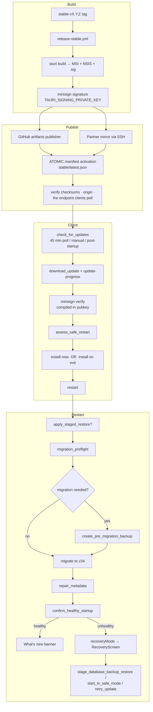

# 09 — Infrastructure and Updates

CI/CD, packaging, release engineering, the updater, and distribution.

---

## 1. CI/CD workflow inventory (4)

| Workflow | Trigger | Runner | Purpose | Concurrency |
|---|---|---|---|---|
| `ci.yml` — *Validate* | PR touching `Paralith-tauri/**` (excl. `*.md`), `scripts/ci/**`, the workflows themselves; push to `main`/`integration` | `windows-latest` | Full desktop validation | grouped, cancel-in-progress |
| `release-stable.yml` — *Release Stable* | `workflow_dispatch` only, with a two-field confirmation | `windows-latest` | The only publishing path | — |
| `web-ci.yml` | PR/push touching `corelith-web/**` | `ubuntu-latest` | Marketing site | grouped, cancel-in-progress |
| `video-ci.yml` | PR/push touching `marketing/paralith-video/**` | `ubuntu-latest` | Remotion product film | grouped, cancel-in-progress |

Only `ci.yml` and `release-stable.yml` concern the application.

**No duplicated or dead workflows found.**

### 1.1 `ci.yml` details

One Windows job so the frontend and Rust gates share a checkout, a dependency install and a Cargo cache. Pull requests additionally perform the native compile (`-IncludeTauriCompile`); pushes to `main` skip it, since `main` receives an already-reviewed commit.

Every action is **pinned to a commit SHA** with a version comment — `actions/checkout@3d3c42e5…  # v7.0.1`, `actions/setup-node@82076278…  # v7.0.0`, `actions/cache@55cc8345…  # v6.1.0`. This is supply-chain hygiene most projects skip.

### 1.2 The validation suite — `scripts/ci/run-checks.ps1`

Ordered, and the order is documented as deliberate (`npm run build` must precede any cargo step because `tauri::generate_context!` reads the built frontend):

| # | Check | Command |
|---|---|---|
| 1 | Canonical release metadata | `npm run release:check` |
| 2 | TypeScript | `npm run typecheck` |
| 3 | Frontend lint | `npm run lint` (oxlint `--deny-warnings`) |
| 4 | Frontend tests | `npm test -- --run` |
| 5 | Production frontend build | `npm run build` |
| 6 | Version sync | `npm run release:sync` |
| 7 | Rust formatting | `cargo fmt --all -- --check` |
| 8 | Rust clippy | `cargo clippy --all-targets --all-features -- -D warnings` |
| 9 | Rust + migration tests | `cargo test --all-targets --all-features` |
| 10 | Tauri compile (PR only) | `npm run tauri -- build --no-bundle --config src-tauri/tauri.stable.conf.json` |

`clippy -D warnings` and `oxlint --deny-warnings` mean **the build treats every lint as an error**. Combined with the audit's finding of zero `TODO`/`FIXME`/`HACK` markers, this explains the codebase's unusual cleanliness.

---

## 2. Editions and version identity

| | Stable | Preview | Local dev |
|---|---|---|---|
| Product name | `PARALITH` | `PARALITH Preview` | `PARALITH` |
| Identifier | `com.corelith.paralith` | `com.corelith.paralith.preview` | `com.corelith.paralith.local-development` |
| Config | `tauri.stable.conf.json` | `tauri.preview.conf.json` | `tauri.conf.json` |
| Pubkey | `release/updater.stable.pubkey` | `release/updater.pubkey` | — |
| Updater | enabled | enabled | **disabled** (`updater_enabled_for(debug) == false`) |
| Bundle targets | `msi`, `nsis` | `msi`, `nsis` | `all` |
| **Publish workflow** | ✅ `release-stable.yml` | ❌ **none exists** | — |

A debug build rewrites `context.config_mut().identifier` to the local-development identity **before** `Builder::build`, so Tauri derives a different single-instance mutex, WebView2 profile and platform data directory. An installed release and `tauri dev` can therefore run side by side without sharing a SQLite file or competing for PTYs. This is a genuinely thoughtful detail (`lib.rs:154-168`).

**Finding:** the Preview edition is fully implemented in the application and in the build tooling (`build:preview`, `release:config:preview`, a provisioned pubkey) but **has no publishing workflow**. It cannot currently ship. **Status: PARTIAL.**

### 2.1 Version synchronisation

`release/version.json` is the single source of truth:

```json
{ "version": "0.4.14", "schemaVersion": 34 }
```

`scripts/release/sync-version.mjs` propagates it; `--check` mode fails CI on drift. Verified consistent: `package.json` 0.4.14, `Cargo.toml` 0.4.14, `CURRENT_SCHEMA_VERSION` 34.

Pinning the **schema version** alongside the product version is unusual and valuable — it lets the updater reason about whether an update implies a migration.

---

## 3. Release pipeline — `release-stable.yml`

### 3.1 Gate design

```yaml
inputs:
  tag: "Existing stable-vX.Y.Z tag on main"
  confirm_all_users:
    default: "DO NOT RELEASE"
    options: ["DO NOT RELEASE", "RELEASE TO ALL STABLE USERS"]
```

A release is **manual by construction**. The default value of the confirmation input is the refusal. Combined with the `stable-release` GitHub environment (reviewer approval + release secrets), there are three independent gates before anything publishes.

### 3.2 Full step sequence (verified)

| # | Step | Purpose |
|---|---|---|
| 1 | Confirm customer-release intent | fails unless the operator selected `RELEASE TO ALL STABLE USERS` |
| 2 | Checkout the protected Stable tag | pinned checkout |
| 3 | **Prove the tagged commit came through main** | provenance — no releasing from a side branch |
| 4-7 | Node, Rust toolchain, Cargo cache, Tauri bundler cache | setup |
| 8 | `npm ci` | locked dependencies |
| 9 | Validate Stable publication configuration | endpoint/pubkey/channel sanity |
| 10 | Validate canonical release metadata and tag identity | version.json ↔ tag agreement |
| 11 | **Run the full validation suite** | the same `run-checks.ps1` as CI |
| 12 | Build signed Stable MSI, NSIS and updater artifacts | `TAURI_SIGNING_PRIVATE_KEY` + `PARALITH_WINDOWS_SIGN_COMMAND` |
| 13 | Verify the assembled 100% Stable release | `verify-release.mjs` |
| 14 | **Archive immutable workflow evidence** | uploaded artifact — an audit trail of the release |
| 15 | Create or verify the private source release | source snapshot |
| 16 | **Publish and atomically activate the public Stable update** | manifest flip |
| 17 | Publish the partner-hosted Stable mirror | SSH-based mirror |
| 18 | Verify public release checksums | post-publish integrity |
| 19 | Verify the canonical Stable origin | correct host |
| 20 | **Verify the endpoint installed Stable apps actually poll** | closes the loop — checks the URL real clients use |
| 21 | Publish release summary | job summary |
| 22 | **`sweep-credentials.ps1`** | removes temporary credentials from the runner |

Steps 3, 14, 16, 20 and 22 are the ones most releases omit. Their presence is the strongest single signal of engineering maturity found in this audit.

### 3.3 Secrets (7)

`TAURI_SIGNING_PRIVATE_KEY`, `TAURI_SIGNING_PRIVATE_KEY_PASSWORD`, `PARALITH_WINDOWS_SIGN_COMMAND`, `PARALITH_UPDATES_TOKEN`, `PARALITH_UPDATES_DEPLOY_KEY`, `PARALITH_MIRROR_SSH_KEY`, `PARALITH_MIRROR_SSH_HOST_KEY`.

All are environment-scoped to `stable-release`, so they are unavailable to PR runs. `PARALITH_MIRROR_SSH_HOST_KEY` being a secret (rather than `StrictHostKeyChecking=no`) is correct.

### 3.4 Release tooling (19 scripts)

| Script | Role |
|---|---|
| `sync-version.mjs` | propagate/verify `version.json` |
| `render-tauri-config.mjs` | inject endpoint + pubkey per edition/mode; **enforces HTTPS in release mode**; refuses a `REPLACE_WITH_` placeholder key |
| `build-edition.mjs` | edition build entry |
| `assemble-release.mjs` | collect artifacts |
| `preflight-publish.mjs` | pre-publish checks |
| `github-artifacts-publisher.mjs` (+ test) | publish to GitHub |
| `mirror-publisher.mjs` (+ test) | publish to the partner mirror |
| `update-distribution.mjs` (+ test) | manifest generation / rollout |
| `verify-published-manifest.mjs` (+ test) | post-publish manifest verification |
| `verify-release.mjs` | assembled-release verification |
| `push-publication-handoff.ps1`, `push-mirror-publication.ps1` | publication handoff |
| `test-update-server.mjs` | local update-server harness (`npm run update-server`) |

**Five of these have their own unit tests** (`*.test.mjs`) — the release tooling is itself tested.

`render-tauri-config.mjs` has a `test` mode that sets `dangerousInsecureTransportProtocol = true`, correctly isolated from `release` mode.

---

## 4. Updater architecture

### 4.1 End-to-end flow



### 4.2 Trust boundary properties

| Property | Implementation |
|---|---|
| Signature verification | `tauri-plugin-updater` with a per-edition minisign pubkey compiled into the binary (`build_info::updater_public_key()`) |
| Key provisioning | `release/updater.stable.pubkey` and `release/updater.pubkey` both contain **real minisign keys**, not placeholders (verified) |
| Channel separation | different identifiers, different pubkeys, different endpoints, different config files |
| HTTPS enforcement | `render-tauri-config.mjs:20` throws if a release endpoint is not `https://` |
| Placeholder guard | throws if the pubkey still starts with `REPLACE_WITH_` in release mode |
| Version monotonicity | delegated to `tauri-plugin-updater` + `semver` |
| Dev safety | updater plugin is **not registered at all** in debug builds |
| Rollback | `create_pre_migration_backup` → `stage_database_backup_restore` → `apply_staged_restore` at next boot |
| Health confirmation | `confirm_healthy_startup` writes to the journal; failure routes to recovery mode |
| Rollout control | `PARALITH_ROLLOUT_PERCENT` env exists in the workflow |

### 4.3 Legacy remnants

| Remnant | Status |
|---|---|
| `firebase.json` at `Paralith-tauri/` root | **LEGACY, harmless.** Configures Firebase Hosting for `update-site-dist` with `no-cache` headers on `/stable/latest.json` and `/preview/latest.json`. No Firebase code exists in the app, and the release workflow publishes via GitHub + an SSH mirror, not Firebase. It documents an earlier hosting approach. |
| GitLab | **none found.** |
| `com.forgemind.workspace` | live migration source, correctly retained |
| `firebase` string in `project_analyzer.rs` | unrelated — the analyser *detects* Firebase in a user's project |

---

## 5. Packaging

| Aspect | Value |
|---|---|
| Targets | `msi` (WiX) and `nsis` |
| Platform | **Windows only** |
| Code signing | `PARALITH_WINDOWS_SIGN_COMMAND` injected into `bundle.windows.signCommand` at config-render time |
| Updater artifacts | `createUpdaterArtifacts` enabled only in `release`/`test` modes |
| macOS / Linux | **not configured** — no `dmg`/`deb`/`appimage` targets, and `window_chrome.rs` uses Windows DWM APIs |

---

## 6. Content Security Policy

From `tauri.conf.json`:

```
default-src 'self' ipc: http://ipc.localhost;
style-src   'self' 'unsafe-inline';
font-src    'self' data:;
img-src     'self' asset: http://asset.localhost data:;
connect-src 'self' ipc: http://ipc.localhost
            ws://localhost:* http://localhost:*
            ws://127.0.0.1:* http://127.0.0.1:*
```

| Observation | Assessment |
|---|---|
| No `script-src` directive | falls back to `default-src 'self'` — inline scripts are blocked. Correct. |
| `style-src 'unsafe-inline'` | required by Monaco and by the dynamic token/geometry styles. A known, bounded trade-off. |
| `connect-src` allows any localhost/127.0.0.1 port over ws/http | deliberate: the app is a dev tool and must reach local dev servers. Widens the renderer's reach to anything listening locally. **Hardening opportunity, not a vulnerability.** |
| The edition configs define no `security` block | **Inherited, verified.** `tauri.stable.conf.json` overrides only `productName`, `mainBinaryName`, `identifier`, `app.windows` and `bundle`; `build-edition.mjs:24` passes it via `--config`, which Tauri merges over `tauri.conf.json`, so the base CSP applies to release builds. **Confidence: HIGH.** |
| Embedded browser | out of scope for this CSP — it is a separate child webview with its own scheme allow-list and **no capability grant** |

---

## 7. Distribution summary

| Question | Answer |
|---|---|
| How does a user install Paralith? | MSI or NSIS installer from a GitHub release (or the partner mirror) |
| How does a user update? | Automatic check every 45 min (default on) → signed download → install now or on exit |
| Can a bad release be rolled back? | Client-side yes (DB backup + recovery mode). Server-side the manifest can be re-pointed, but no explicit "rollback release" workflow exists. |
| Is there a beta channel? | Configured (Preview) but **unpublishable** — no workflow |
| Is there telemetry on update success? | Local only — the update journal and log file. Nothing is reported to a server. |
| Are releases reproducible? | Partially — `PARALITH_BUILD_TIMESTAMP` and `PARALITH_GIT_COMMIT` are stamped, dependencies are locked (`npm ci`, `Cargo.lock`), actions are SHA-pinned. Full bit-for-bit reproducibility not claimed or verified. |

---

## 8. Infrastructure findings

| # | Finding | Severity |
|---|---|---|
| 1 | Preview channel has no publishing workflow — an implemented edition that cannot ship | P2 |
| 2 | `firebase.json` documents a hosting approach the pipeline no longer uses | P3 |
| 3 | No rollback workflow; recovering from a bad Stable release is a manual manifest operation | P2 |
| 4 | Windows-only; `window_chrome.rs`, bundle targets and `run-checks.ps1` (PowerShell) all assume Windows | P3 (a stated product scope, not a defect) |
| 5 | No `VACUUM` / log-pruning / cache-eviction maintenance job anywhere | P3 |
| 6 | `connect-src` permits any localhost/127.0.0.1 port over `ws`/`http` — necessary for a dev tool, but it means any locally-listening service is reachable from the renderer | P3 hardening |
