# 13 — Integration Matrix

How Paralith's subsystems actually connect. Paralith's product value depends on these links more than on any single feature, so this document distinguishes what is wired from what merely could be.

**Maturity:** ● strong · ◐ partial · ○ **missing but expected** · — not applicable

---

## 1. Master matrix

Rows = System A (source), columns = System B (target). Cell = the integration A→B.

| A ↓ / B → | Project | Workspace | Window | Editor | Terminal | Agent | Swarm | Worktree | Git | RepoCC | Browser | DBStudio | Memory | Context | CodeGraph | Semantic | Proof | Usage | Notif | Update |
|---|---|---|---|---|---|---|---|---|---|---|---|---|---|---|---|---|---|---|---|---|
| **Project** | — | ● | ● | ● | ● | ● | ● | ● | ● | ● | ◐ | ● | ● | ● | ● | ● | ◐ | ○ | — | — |
| **Workspace** | ● | — | ● | ● | ● | ● | ◐ | ◐ | ◐ | ◐ | ● | ○ | ○ | ○ | ○ | ○ | ○ | ● | ◐ | — |
| **Window** | ● | ● | — | ◐ | ● | ◐ | ○ | — | ○ | ○ | ● | ○ | ○ | — | — | — | — | ○ | ○ | ● |
| **Editor** | ● | ● | ◐ | — | ◐ | ○ | ○ | ○ | ◐ | ◐ | ○ | ○ | ○ | ○ | **○** | ○ | ○ | — | ○ | — |
| **Terminal** | ● | ● | ● | ○ | — | ● | ● | ● | ● | ○ | ◐ | ○ | ○ | ○ | ○ | ○ | ◐ | ◐ | ◐ | — |
| **Agent (pane)** | ● | ● | ◐ | ○ | ● | — | ○ | ◐ | ◐ | ○ | ◐ | ○ | **○** | **○** | **○** | ○ | **○** | ● | ◐ | — |
| **Swarm** | ● | ◐ | ○ | ○ | ● | ● | — | ● | ● | ◐ | ○ | ○ | ● | ◐ | **○** | **○** | ● | ○ | ◐ | — |
| **Worktree** | ● | ◐ | ○ | ○ | ● | ● | ● | — | ● | ● | — | ○ | ○ | ○ | ○ | ○ | ◐ | — | ○ | — |
| **Git** | ● | ◐ | ○ | ◐ | ● | ◐ | ● | ● | — | ● | — | ○ | ◐ | ○ | ○ | ○ | ● | — | ◐ | — |
| **RepoCC** | ● | ◐ | ○ | ◐ | ○ | ○ | ◐ | ● | ● | — | ○ | ○ | ○ | ○ | ○ | ○ | ● | ○ | ◐ | — |
| **Browser** | ◐ | ● | ● | ○ | ● | ● | ○ | — | — | — | — | ○ | ○ | ○ | — | — | ○ | — | ○ | — |
| **DBStudio** | ● | ○ | ○ | ○ | ○ | ○ | ○ | ○ | ◐ | ○ | ○ | — | ◐ | ◐ | ○ | ○ | ○ | ○ | ○ | — |
| **Memory** | ● | ○ | ○ | ○ | ○ | **○** | ● | ○ | ◐ | ○ | ○ | ◐ | — | ● | **○** | ◐ | ◐ | ○ | ◐ | — |
| **Context** | ● | ○ | ○ | ○ | ○ | **○** | **○** | ○ | ○ | ○ | ○ | ○ | ● | — | **○** | **○** | ○ | ○ | ○ | — |
| **CodeGraph** | ● | ○ | ○ | **○** | ○ | **○** | **○** | ○ | ○ | ○ | ○ | ○ | **○** | **○** | — | ○ | ○ | ○ | ○ | — |
| **Semantic** | ● | ○ | ○ | ○ | ○ | **○** | **○** | ○ | ○ | ○ | ○ | ○ | ◐ | **○** | ○ | — | ○ | ○ | ○ | — |
| **Proof** | ● | ○ | ○ | ○ | ◐ | ◐ | ● | ◐ | ● | ● | ○ | ○ | ◐ | ○ | ○ | ○ | — | ○ | ○ | — |
| **Usage** | ○ | ● | ○ | — | ◐ | ● | ○ | — | — | ○ | — | ○ | ○ | ○ | ○ | ○ | ○ | — | ○ | — |
| **Notif** | ○ | ◐ | ○ | ○ | ◐ | ◐ | ◐ | ○ | ◐ | ◐ | ○ | ○ | ◐ | ○ | ○ | ○ | ○ | ○ | — | ● |
| **Update** | — | ● | ● | — | ● | — | ○ | — | — | — | — | — | — | — | — | — | — | — | ● | — |

Bold `○` marks a **missing link that the product's own architecture implies should exist**.

---

## 2. Strong integrations (● — verified)

| A → B | Mechanism | Evidence |
|---|---|---|
| Project → everything | `projects(id)` with `ON DELETE CASCADE` on 169 relationships | `migrations.rs` |
| Workspace → Terminal | pane assignment → PTY session; restoration on open | `restoration_scheduler.rs` |
| Window → Terminal | **exclusive interactive lease** gates input | `window_registry.rs:220`, `terminal_commands.rs:65,81` |
| Window → Browser | child webview owned by the window; `close_for_window` on destroy | `lib.rs:860` |
| Window → Update | update events broadcast to **all** windows via the attached app handle | `lib.rs:473` |
| Terminal → Agent | provider CLI in a PTY, machine-protocol geometry, agent-state detection | `terminal_manager.rs` |
| Terminal ↔ Git | per-pane branch/worktree — `get_pane_git_review`, `create_isolated_pane_worktree` | `git_commands.rs` |
| Swarm → Terminal | one PTY per agent, driven by the scheduler | `swarm_service.rs:1051` |
| Swarm → Worktree | isolated worktree per agent + declared `file_scope` | `swarm_worktrees`, `swarm_file_ownership` |
| Swarm → Git | worktree leases, commits, integration | `RepositoryOperation::CreateAgentWorktree` |
| Swarm → Proof | evidence, test records, reviews, **completion gate** | `swarm_service.rs:4208` |
| **Swarm → Memory** | run → handoff → candidates → review → memory | `swarm_service.rs:4311` → `knowledge_lifecycle.rs:211` |
| Memory → Context | `ContextCompiler` reads the Fabric | `context_compiler.rs` |
| Git → Proof | commit SHA as verifiable evidence (`source_uri: git:<sha>`) | `swarm_service.rs:607` |
| RepoCC → Worktree | worktree leases + conflict-risk detection | `get_worktree_conflict_risks` |
| Browser → Agent | Inspect mode → sanitised package typed into the active pane | `WorkspaceScreen.tsx:310` |
| Usage → Agent | Claude/Codex quota read from the same CLIs that run the agents | `usage_service.rs` |
| Project → FileWatch → {Memory, CodeGraph, DBStudio} | one watcher fans out to three consumers | `lib.rs:384-388` |

That last one deserves emphasis: `FileWatchService::new(…).with_database_studio(…).with_knowledge_lifecycle(…).with_code_intelligence(…)` is a genuinely good piece of composition — a **single** watcher per project feeding three independent subsystems, rather than three watchers.

---

## 3. 🔴 Missing links the architecture implies

These are the integration gaps that matter, in priority order.

### M1 — Context → Agent (**the defining gap**)

`ContextCompiler` (1,621 LOC, 27 tests) does retrieval, ranking, token budgeting, citations and staleness handling. Its only consumer is `MemoryContext.tsx`, a human preview panel.

Agents get `ensure_swarm_context_pack`: `ORDER BY pinned DESC, updated_at DESC LIMIT 8`.

**Both ends exist. Neither end needs to change. Only the call site does.**

### M2 — CodeGraph → Agent / Context / Editor

The code graph knows symbols, imports, references and impact. It is kept current by the watcher. Nothing consumes it:

- an agent starting a task is not told which symbols the task touches
- `ContextCompiler` cannot rank memories by code proximity
- the editor has no go-to-definition or find-references despite `code_symbol_detail` and `code_dependencies` existing

### M3 — Agent (pane) → Memory

A user running Claude in a terminal pane produces **no handoff, no candidates, no knowledge**. Only Swarm runs feed the Fabric.

This is the highest-frequency user action in the product, and it is the one that teaches Paralith nothing.

### M4 — Semantic → Context

The embedding index is designed to "contribute candidates, never rerank a deterministic result" (`lib.rs:41`) — a well-reasoned role. It contributes nothing, because `ContextCompiler` does not query it and nothing populates it.

### M5 — Memory → Editor

The editor does not surface memories relevant to the open file. `memory_impact` maps changed paths → affected memories; the inverse (path → relevant memories) is the same index read the other way.

### M6 — DBStudio → Agent

`database_build_context_pack` and `agent_ops.rs` exist specifically to give an agent schema context. No agent-launch path calls them.

### M7 — Swarm → Workspace / Window

A Swarm's agent terminals exist as sessions, and `focus_swarm_agent_terminal` can focus one — but Swarms do not compose onto the Workspace canvas as panes, and cannot be detached to their own window. The Swarms route is a separate full-screen surface.

### M8 — Everything → Notifications

There is no notification system. Attention state exists only inside the sidebar; swarm attention requests, repository approvals, update availability and knowledge conflicts each surface only within their own route.

A user with the Workspace route open does not learn that a Swarm needs a decision, a repository approval is pending, or a knowledge conflict was detected.

### M9 — Orchestrator → Swarm

The Orchestration Kernel supervises "missions, swarms, and agents" per its own doc comment. It has no capability that touches `SwarmService`. Its 6 capabilities are `project.list`, `workspace.list`, `terminal.list`, `setting.read`, `file.read`, `file.write`.

---

## 4. Integration health by subsystem

| Subsystem | In-edges | Out-edges | Assessment |
|---|---|---|---|
| **Project** | many | many | **Hub.** Correctly the root aggregate. |
| **Terminal** | many | many | **Hub.** The product's spine; well connected. |
| **Swarm** | ● from Project/Terminal/Worktree | ● to Memory/Proof/Git | **Best-integrated feature.** The only one that closes a loop. |
| **Git / RepoCC** | ● | ● | Well connected to Worktree, Proof, Terminal. |
| **Memory** | ● from Swarm/FileWatch | ● to Context | Good in-edges, one out-edge, and that out-edge dead-ends in a UI panel. |
| **Window** | ● | ● | Well integrated for its scope. |
| **Browser** | ◐ | ◐ | One strong link (Inspect → agent); otherwise isolated. |
| **DBStudio** | ◐ from Project/FileWatch | ○ | **Nearly isolated.** Reads the project, writes migrations, tells nothing else. |
| **Context** | ● from Memory | **○** | **Terminal node** — nothing consumes its output. |
| **CodeGraph** | ● from FileWatch | **○** | **Terminal node.** |
| **Semantic** | ○ | ○ | **Orphan node** — no in-edges, no out-edges. |
| **Orchestrator** | ○ | ◐ (6 read/write caps) | **Nearly orphan.** |
| **Usage** | ● from Agent | ○ | Read-only leaf; appropriate. |
| **Notifications** | — | — | **Does not exist.** |

---

## 5. The integration graph

```mermaid
flowchart TB
  P[Project]
  W[Workspace]
  WIN[Window]
  T[Terminal]
  A[Agent pane]
  S[Swarm]
  WT[Worktree]
  G[Git]
  RC[Repo Command Center]
  B[Browser]
  E[Editor]
  DB[Database Studio]
  M[Memory Fabric]
  CX[Context Compiler]
  CG[Code Graph]
  SE[Semantic Index]
  PR[Proof / Evidence]
  U[Usage]
  OR[Orchestrator]
  FW[File Watcher]

  P --> W --> T
  P --> FW
  FW --> M
  FW --> CG
  FW --> DB
  W --> WIN
  WIN -.lease.-> T
  T --> A
  T -.per-pane branch.-> G
  S --> T
  S --> WT --> G
  S --> PR
  S ==handoff==> M
  M --> CX
  G --> RC
  RC --> WT
  RC --> PR
  B -.inspect→agent.-> A
  A --> U
  E --> P
  DB -.migrations.-> G

  CX -.->|ONLY| MC[MemoryContext.tsx<br/>human preview]
  CG -.->|nothing| X1[ ]
  SE -.->|nothing| X2[ ]
  OR -.->|6 read/write caps| P

  CX -. MISSING .-> A
  CX -. MISSING .-> S
  CG -. MISSING .-> CX
  CG -. MISSING .-> E
  SE -. MISSING .-> CX
  A -. MISSING .-> M
  DB -. MISSING .-> A

  style CG fill:#3a2020,stroke:#a44
  style SE fill:#3a2020,stroke:#a44
  style OR fill:#3a2020,stroke:#a44
  style CX fill:#3a3020,stroke:#a84
  style X1 fill:none,stroke:none
  style X2 fill:none,stroke:none
```

---

## 6. Summary

| | Count |
|---|---|
| Strong integrations verified | 18 |
| Partial integrations | ~30 |
| **Missing links the architecture implies** | **9** |
| Terminal nodes (produce output nothing consumes) | 2 — Context Compiler, Code Graph |
| Orphan nodes (no in- or out-edges) | 1 — Semantic Index |
| Systems that close a full loop | **1 — Swarm** |

**The central observation of this audit:** Paralith has exactly one subsystem that completes a cycle — Swarm → Terminal → Agent → Evidence → Handoff → Memory → (Context) → back toward the next agent. That cycle is broken at its final arc, because Context does not reach the agent.

Closing M1, M2 and M3 would turn the product's largest collection of unused capability into its primary differentiator, and would do so by connecting components that already exist and are already tested — not by building new ones.
